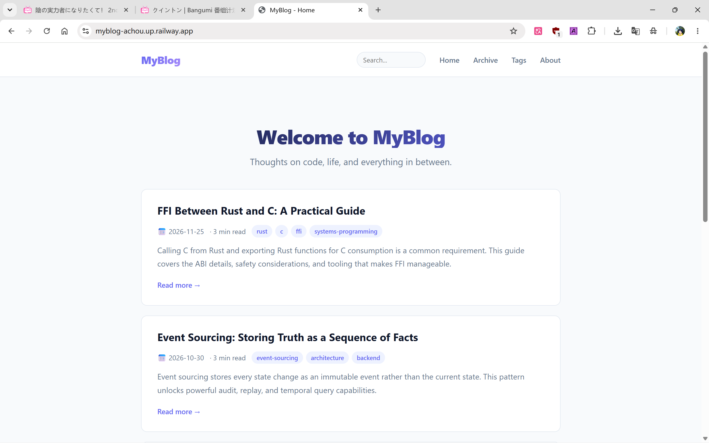

# MyBlog

Personal blog built with **Rust + Axum 0.7**. Flat-file, no database. Markdown posts with TOML frontmatter.



## Features

- Markdown rendering with syntax highlighting (syntect, with alias mapping for common language names)
- RSS feed & XML sitemap
- Tag cloud, archive by year/month, full-text search
- Related posts, pagination, reading time
- CSP headers, XSS protection, accessibility (skip-link, aria-labels)
- Comments via [utterances](https://utteranc.es) (GitHub Issues-based, client-side)
- 120 tests (87 unit + 33 integration), zero clippy warnings

## Quick Start

```bash
cargo run
# → http://127.0.0.1:3000
```

## Writing Posts

Create `posts/my-post.md`:

```toml
+++
title = "My Post"
date = "2024-06-15"
tags = ["rust", "web"]
excerpt = "Optional excerpt"
+++

## Content here
```

Slug is derived from the filename (`my-post`). No database, no admin panel — just push `.md` files.

## Configuration

### Site Config (`config/site.json`)

```json
{
  "title": "MyBlog",
  "description": "A personal blog built with Rust and Axum",
  "url": "http://127.0.0.1:3000",
  "posts_per_page": 5
}
```

Can be overridden by environment variables:

| Variable | Description |
|----------|-------------|
| `SITE_TITLE` | Overrides `title` in config |
| `SITE_DESC` | Overrides `description` in config |
| `SITE_URL` | Overrides `url` in config |
| `POSTS_PER_PAGE` | Overrides `posts_per_page` in config |

Priority: **env var > config file > code default**.

### About Config (`config/about.json`)

```json
{
  "author_name": "阿愁",
  "avatar_path": "/static/images/avatar.jpg"
}
```

Editable inline on `/about` page — click the name to edit, click the avatar to upload a new one (with cropping).

## Deployment

Recommended: **Railway** (auto-detects Dockerfile, free quota).

1. Push to GitHub
2. Railway → New Project → Deploy from GitHub repo
3. Set environment variables in dashboard
4. Done — subsequent pushes auto-deploy

Or deploy anywhere that supports Docker.

## License

MIT
