+++
title = "《多处理器编程的艺术》 第二章 互斥"
date = "2026-07-26"
tags = ["multiprocessor-programming", "concurrency", "mutex", "deadlock-free", "starvation-free", "FCFS"]
+++

<h1 align="center">多处理器编程的艺术</h1>
<h2 align="center">第二章 互斥</h2>

互斥可能是多处理器程序设计中最为常见的一种协作形式。本章将介绍基于读写共享存储的各类经典互斥算法——虽然这些算法已不再实际使用，但它们体现了同步领域中算法设计和正确性证明的典型问题，是很好的入门素材，值得深入研习。

此外，本章还将给出一个不可解性证明，揭示读写共享存储在解决互斥问题时的内在局限。这一结论将为后续章节中面向实际应用的互斥算法奠定理论基础。

本章也是全书中为数不多包含完整算法证明的章节之一。读者虽可跳过这些证明，但我仍建议花些时间理解其中的推理方式——因为同样的分析方法，在后续章节的实用算法推导中还会反复出现。

## 1. 时间和事件

并发计算的本质是对时间的推理。在实际场景中，我们有时希望多个事件同时发生，有时又希望它们错开时间。为了清晰地描述各种复杂的时间关系——比如多个时间区间是相互重叠，还是彼此错开——我们需要一套精确而无歧义的语言来讨论事件及其持续时间。鉴于日常英语的模糊性和歧义性，我们在此引入一套专用的词汇和符号，用于描述并发线程在时间维度上的行为特征。

1687年，牛顿曾写道：“绝对的、真实的、数学意义上的时间，由其自身且仅由其自身的性质决定，永远均匀地流逝着，与任何外部事物无关。” 我们完全认同牛顿的时间观念——虽然对他的散文风格不敢恭维。在我们的模型中，所有线程共享一个统一的时间轴（它们不必共用同一个物理时钟）。每个线程可看作一个**状态机**，其状态的每一次切换称为一个**事件**。

事件是**瞬时发生**的，即不占用任何时间长度。为便于讨论，我们假定任意两个不同的事件绝不会发生在同一时刻——即不同事件的时间戳互不相同（若两个事件发生时间极其接近，导致我们无法判断其先后顺序，那么任取一种顺序均可）。每个线程 A 产生一个事件序列 a₀, a₁, a₂, ……（程序中通常包含循环，因此单个语句可以产生多个事件）。若事件 a **先于**事件 b 发生，则记为 a → b，表示事件 a 发生时间相较于 b 更早。这种“→”关系在事件集合上构成了一个**全序关系**——即任意两个事件都可比较先后。

现在考虑事件之间的**时间间隔**。设 a₀ → a₁，则时间间隔 (a₀, a₁) 表示 a₀ 与 a₁ 两个事件之间的那一段持续时间。对于两个时间间隔 I~A~ = (a₀, a₁) 和 I~B~ = (b₀, b₁)，若 a₁ → b₀（即 I~A~ 的结束事件早于 I~B~ 的开始事件），则称时间间隔 I~A~ 先于时间间隔 I~B~，记作 I~A~ → I~B~。需要注意，时间间隔上的“→”关系不再是全序，而是**偏序关系**——因为两个时间间隔若相互重叠，它们之间便不存在“→”关系。对于那些彼此之间不存在“→”关系的时间间隔，我们称它们为**并发**的。类似地，若事件 a 满足 a → b₀，则称事件 a 先于时间间隔 I = (b₀, b₁)，记作 a → I；若 b₁ → a，则称时间间隔 I 先于事件 a，记作 I → a。

## 2. 临界区

在第 1 章中，我们讨论了如图 2.1 所示的 Counter（计数器）类的实现。可以看到，这种实现在单线程系统中是正确的，但是当被两个或者多个线程使用时会出现错误行为。如果两 个线程都读取了标记为“危险区域开始”那一行的 value 字段的值，然后又都更新了标记为 “危险区域结束”那一行的 value 字段的值，就会出现此类问题。

```java
class Counter {
    private long value;
    public Counter(long c) {			// 构造函数
        value = c;
    }
    // 递增并返回先前值
    public long getAndIncrement() {
        long temp = value;				// 危险区域开始
        value = temp + 1;				// 危险区域结束
        return temp;
    }
}
```

<p align="center">图 2.1 Counter 类</p>

我们可以通过将这两行代码变成一个临界区 (critical section) 来避免这个问题：临界区中的代码块一次只能由一个线程执行。我们称这种特性为**互斥** (mutual exclusion)。实现互斥的标准方法是采用满足图 2.2 所示的 Lock (锁) 接口。

```java
public interface Lock {
    public void lock();					// 进入临界区之前调用
    public void unlock();				// 离开临界区之前调用
}
```

图 2.3 显示了如何使用 Lock 对象在共享计数器对象中实现互斥。使用 lock() 方法和 unlock() 方法的线程必须遵循特定的用法。符合以下条件则线程使用锁的方法符合要求：

1. 每个临界区都与一个 Lock 对象相关联。
2. 当线程进入临界区时，调用该 Lock 对象的 lock() 方法。
3. 当线程离开临界区时，调用该 Lock 对象的 unlock() 方法。

```java
class Counter {
    private long value;
    private Lock lock;					// 用户保护临界区

    public long getAndIncrement() {
        lock.lock();					// 进入临界区
        try {		
            long temp = value;			// 在临界区中
            value = temp + 1;			// 在临界区中
            return temp;
        } finally {
            lock.unlock();				// 离开临界区
        }
    }
}
```

<p align="center">图 2.3 使用一个 Lock (锁) 对象</p>

当从 lock() 方法的调用返回时，线程**获取**或者**锁定**（acquire 或者 lock）一个锁，在调用 unlock() 方法时，线程**释放**或者**解锁**（release 或者 unlock）该锁。如果线程已经获得了一个锁，并且随后并没有释放该锁，我们称线程**持有**（hold）该锁。任何线程都不能在其他线程持有某个锁的情况下获取该锁，因此在任何时候最多只有一个线程持有该锁。如果一个线程持有锁，我们称该锁为**占有状态**（busy）；否则，我们称该锁为**空闲状态**（free）。

多个临界区可能与同一个锁相关联，在这种情况下，当任何线程正在执行与同一个锁相关联的其他临界区时，其他线程不可以执行该临界区。从锁算法的角度来看，线程在其对 lock() 方法的调用返回时启动执行临界区，并通过调用 unlock() 方法结束执行临界区；也就是说，线程在持有锁的同时执行临界区代码。

假设每个获得锁的线程最终都会释放锁，下面我们将更精确地阐述一个好的锁算法应该满足哪些特性。

* **互斥**（mutual exclusion）：在任何时候最多只能有一个线程持有锁。
* **无死锁性**（freedom from deadlock）：如果一个线程调用 `lock()` 或 `unlock()` 后始终未能返回（即被阻塞），那么系统中必然存在某个线程能够成功获取或释放锁并返回。进一步地，若某个线程调用 `lock()` 后永远无法返回，则必定有其他线程在无限循环地反复进出临界区，导致该线程始终无法获取锁。
* **无饥饿性**（freedom from starvation）：每一个试图获取或者释放锁的线程最终都会成功（即该线程每次调用 lock() 方法或者 unlock() 方法后最终都会返回）。

请注意，无饥饿性蕴含着无死锁性。

很显然，互斥特性是必不可少的。这个特性可以确保临界区（即在获取锁和释放锁之间执行的代码）一次最多由一个线程执行。换而言之，临界区的执行不能重叠。如果没有这个互斥特性，我们就不能保证计算结果的正确性。

设 CS^j^~A~ 是线程 A 第 j 次执行临界区的时间间隔。CS^j^~A~ = (a~0~，a~1~)，其中 a~0~ 是线程 A 对 lock() 方法的第 j 次调用的响应事件，a~1~ 是线程 A 对 unlock() 方法的第 j 次调用的调用事件。 对于两个不同的线程 A 和 B 以及整数 j 和 k，要么 CS^j^~A~ -> CS^k^~B~ 成立，要么 CS^k^~B~ -> CS^j^~A~ 成立。

无死锁特性非常重要。这意味着系统永远不会“冻结”。如果某个线程调用 lock() 方法并且从未获取锁，则意味着要么其他某个线程获取但从不释放该锁，要么其他线程必须无限重复执行临界区代码。个别线程可能会永远被阻塞（称为饥饿），但有些线程会正在运行。

无饥饿特性虽然是最令人满意的一种特性，但在三个特性中却是最不需要保持的一种特性。这个特性有时被称为**无锁定性**( lockout-freedom)。在后面的章节中，我们将讨论一些切实可行的互斥算法，虽然这些算法并不满足无饥饿特性。这些算法通常应用在理论上可能出现饥饿但实际上不太可能会出现饥饿的场景中。然而，掌握饥饿特性的推理能力对于理解饥饿是否存在实际的威胁至关重要。

在某种意义上无饥饿特性并不严格，因为它不能保证线程在进入临界区之前需要等待多 长时间。在后面的章节中，我们将讨论能够限制线程等待时间的算法。

根据第 1 章中的术语，互斥是一种安全特性，而无死锁特性和无饥饿特性是活跃特性。

## 3. 双线程解决方案

接下来我们讨论解决双线程互斥问题的算法。假设双线程锁算法遵循以下约定：线程的标识 1D 分别为 0 和 1，线程可以通过调用 ThreadlD.get() 获取其标识。我们将调用线程的标识存储在 i 中，另一个线程的标识存储在 j= 1-i 中。

我们首先讨论两个不完美但却十分有趣的线程锁算法。

### 3.1 LockOne

LockOne 算法如图 2.4 所示，该算法为每个线程设置一个布尔 flag (标志) 变量。为了获得锁，线程将其布尔标志设置为 true，并等待另一个线程的布尔标志变为 false。线程通过将其布尔标志重置为 false 来释放该标志。

我们使用 write~A~(x = v) 表示线程 A 将值 v 赋给变量 x 这一事件，使用 read~k~(x == v) 表示线程 A 从变量 x 读取 v 这一事件。例如，在图 2.4 中，第 7 行代码中的 lock() 方法引发事件 write~A~(flag[i] = true)。当值 v 无关紧要时，有时会忽略。

```java
class LockOne implements Lock {
    private boolean[] flag = new boolean[2];
    // 线程本地索引，0 或者 1
    public void lock() {
        int i = ThreadID.get();
        int j = 1 - i;
        flag[i] = True;
        while (flag[j]) {}					// 等待，直到 flag[j] = false
    }
    public void Unlock() {
        int i = ThreadID.get();
        flag[i] = false;
    }
}
```

<p align="center">图 2.4 LockOne 算法的伪代码</p>

**引理 2.3.1** LockOne 算法满足互斥特性。

**证明**  假设 LockOne 算法不满足互斥特性。那么，线程 A 和线程 B 分别对应的 临界区 CS~A~ 和 CS~B~ 存在重叠。考虑每个线程在进人临界区之前最后一次执行 lock() 方法的情形。通过观察代码我们发现：

write~A~(flag[A] = true) -> read~A~(flag[B] == false) -> CS~A~

write~B~(flag[B] = true) -> read~B~(flag[A] == false) -> CS~B~

注意，一旦将 flag[B] 设置为 true, 它将保持为 true. 直到线程 B 退出其临界区。由于临界区重叠，线程 A 必须在线程 B 设置为 true 之前读取 flag[B]。类似地，线程 B必须在线程 A 将其设置为 true 之前读取 flag[A]。综上所述，我们得到：

write~A~(flag[A]=true) -> read~A~(flag[B]==false) 

-> write~B~(flag[B]=true) -> read~B~(flag[A]==false) 

-> write~A~(flag[A]=true)

因为 ”->“ 运算是偏序关系 (事件不能先于自身)，所以在 “->” 运算中存在有一个循环，从而产生了矛盾。证毕。

LockOne 算法并不完美，因 为如果两个线程交错执行，结果会产生死锁：如果 write~A~(flag[A] = true) 和 write~B~(flag[A] = true) 事件发生在 read~A~(flag[B]) 和 read~B~(flag[A]) 事件之前，那么这两个线程都将永远相互等待。然而，LockOne 算法有一个有趣的特性：如果一个线程在另一个线程之前运行，那么将不会发生死锁，一切运行良好。

### 3.2 LockTwo

另一种锁算法 LockTwo 类如图 2.5 所示。该算法使用单个 victim 字段来指示哪个线程应该让步。为了获取锁，一个线程将 victim 字段设置为白己的标识 ID，然后等待直到另 一个线程更改该变量。

```java
class LockTwo implements Lock {
    private int victim;
    public void lock() {
        int i = ThreadID.get();
        victim = i;					// 让另一个线程先运行
        while (victim == i) {}		// 等待
    }
    public void unlock() {}
}
```

<p align="center">图 2.5 LockTwo 算法的伪代码</p>

**引理 2.3.2**  LockTwo 算法满足互斥特性，

**证明**  假设 LockTwo 算法不满足互斥特性。那么，线程 A 和线程 B 分别对应的临界区 CS~A~，和 CS~B~ 存在重叠。考虑每个线程在进入临界区之前最后一次执行 lock() 方法的情形。通过观察代码我们发现：

write~A~(victim = A) -> read~A~(victim == B) -> CS~A~

write~B~(victim = B) -> read~B~(victim == A) -> CS~B~

线程 B 必须在 write~A~(victim = A) 和 read~A~(victim == B) 之间将 B 赋值给 victim 字段，因此线程 B 必须在线程 A 之后对 victim 赋值。然而，根据同样的推理，线程 A 必须在线程 B 之 后对 victim 赋值，因而产生了矛盾。证毕。 

LockTwo 算法也并不完美，除非多个线程并发运行，否则也会产生死锁。不过，LockTwo 算法也有一个有趣的特性：如果多个线程并发运行，lock() 方法一定会成功。 LockOne 算法和 LockTwo 算法彼此互补：在一个算法死锁的情形下另一个算法成功。

### 3.3 Peterson Lock

我们结合 LockOne 算法和 LockTwo 算法构造了一个无饥饿特性的锁算法，如图 2.6 所示。这种算法被称为**彼得森算法** (Peterson's algorithm)，以其发明者命名。可以说，彼得森算法是最简洁优雅的双线程互斥算法。

```java
class Peterson implements Lock {
    // 线程本地索引，0 或 1
    private boolean[] flag = new boolean[2];
    private int victim;
    public void lock() {
        int i = ThreadID.get();
        int j = i - 1;
        flag[i] = true;				// 我感兴趣（需要进入临界区）
        victim = i;					// 你先运行（让步使对方先进入临界区）
        while (flag[j] && victim == i) {}	// 等待
    }
    public void unlock() {
        int i = ThreadID.get();
        flag[i] = false;			// 我不感兴趣（不需要进入临界区）
    }
}
```

<p align="center">图 2.6 彼得森锁算法的伪代码</p>

**引理 2.3.3**  彼得森锁算法满足互斥特性。

**证明**  假设彼得森锁算法不满足互斥特性。如前所述，考虑线程 A 和线程 B 在进入重叠临界区 CS~A~ 和 CS~B~ 之前最后一次执行 lock() 方法的情形。通过观察代码我们发现：

write~A~(flag[A]=true) -> write~A~(victim=A) -> read~A~(flag[B]) -> read~A~(victim) -> CS~A~

write~B~(flag[B]=true) -> write~B~(victim=B) -> read~B~(flag[A]) -> read~B~(victim) -> CS~B~

在不失一般性的情况下，假设线程 A 是最后一个写入 victim 字段的线程，即：

write~B~(victim=B) -> write~A~(victim=A)

线程 A 观察到 victim 为线程 A。既然线程 A 要进入临界区，那么它一定观察到 flag[B] 为 false，因此：

write~A~(victim=A) -> read~A~(flag[B]==false)

结合上述公式可以得出：

write~B~(flag[B]=true) -> write~B~(victim=B) -> write~A~(victim=A) -> read~A~(flag[B]==false)

根据 “->” 运算的传递性，write~B~(flag[B]=true) -> read~A~(flag[B]==false)。这一观察结果产生了矛盾，因为在临界区运行之前没有其他写入 flag[B] 的操作。证毕。

**引理 2.3.4**  彼得森锁算法满足无饥饿特性。

**证明**  假设彼得森锁算法不满足无饥饿特性，那么一定有线程一直在 lock() 方法中运 行。假设（不失一般性）该线程是 A 则它必定在执行 while 语句，并等待 flag[B] 变为 false 或者 victim 被设置为 B。

当线程 A 停滞不前时，线程 B 在做什么呢？也许线程 B 在反复地进入和离开其临界区。 如果是这样的话，那么线程 B 会在再次进入临界区之前将 victim 设置为 B。一旦 victim 被 A 设置为 B, 它就不会改变，线程 A 最终肯定会从 lock() 方法返回，因而产生了矛盾。

所以线程 B 也一定是在其 lock() 方法调用中被阻塞了，一直等到 flag[A] 变为 false 或者 victim 被设置为 A。但是 victim 不能同时是 A 和 B，因而产生了矛盾。证毕。

**推论 2.3.5**  彼得森锁算法满足无死锁特性。

## 4. 关于死锁的说明

尽管彼得森锁算法满足无死锁特性（甚至还满足无饥饿特性），但是在使用多个彼得森锁 （或者任何其他锁实现）的程序中可能会出现另一种类型的死锁。例如，假设线程 A 和线程 B 共享锁 L~0~ 和锁 L~1~ 并且线程 A 获取锁 L~0~，线程 B 获取锁 L~1~。如果线程 A 随后尝试获取锁 L~1~，而线程 B 尝试获取锁 L~0~， 则两个线程都会死锁，因为每个线程都在等待另一个线程释放其锁。

文献中，术语**死锁**（deadlock）有时被更狭义地用来指系统进人某种状态，在这种状态下线程无法继续执行。LockOne 算法和 LockTwo 算法容易陷入这种死锁的状态：在这两种算法中，两个线程都会在各自的 while 循环中等待停滞。

上述死锁的狭义概念与**活锁**（livelock）不同。在活锁中，两个或多个线程持续执行操作，但这些操作互相抵消了彼此的进展，导致任何线程都无法完成自己的任务。与死锁不同，活锁中的线程并未阻塞，它们在不停运转，只是永远到不了终点。在某些调度方式下，系统能够取得进展；但在另一些调度方式下，则不会有任何进展。我们对无死锁特性的定义，排除了活锁以及狭义上的死锁。

```java
class Livelock implements Lock {
    private boolean[] flag = new boolean[2];
    public void lock() {
        int i = ThreadID.get();
        int j = 1 - i;
        flag[i] = true;
        while flag[j] {
            flag[i] = false;
            while flag[j] {}				// 等待
            flag[i] = true;
        }
    }
    public void unlock() {
        int i = ThreadID.get();
        flag[i] = false;
    }
}
```

<p align="center">图 2.7 可能会导致活锁的一种锁算法的伪代码</p>

例如，考虑图 2.7 中的 Livelock 算法。（这是 1.2 节中描述的旗帜协议的变体，其中两个线程都遵循鲍勃部分的协议）。如果两个线程都执行 lock() 方法，它们可能会无限循环地重复以下步骤：

* 将它们各自的 flag 变量设置为 true。 
* 检查另一个线程的 flag 值是否为真。 
* 将各自的 flag 变量的值设置为 false。 
* 检查另一个线程的 flag 值是否为 false。

由于存在这种可能的活锁，根据我们的定义， Livelock 算法并不满足无死锁特性。

但是，Livelock 算法并不会因为如上的狭义定义而产生死锁，因为总有一些方法可以调度线程，以便其中一个线程能够继续运行：如果一个线程的 flag 的值为 false，那么执行另一个线程，直到它退出循环并返回。如果两个线程的 flag 变量的值都为 true，那么执行其中一个线程，直到该线程将其 flag 的值设置为 false，然后按上述方法执行另一个线程。

## 5. 过滤锁

```java
class Filter implements Lock {
    int[] level;
    int[] victim;
    public Filter(int n) {
        level = new int[n];
        victim = new int[n];				// 使用 1,...,n-1
        for (int i = 0; i < n; i++) {
            level[i] = 0;
        }
    }
    public void lock() {
        int me = ThreadID.get();
        for (int i = 1; i < n; i++) {		// 尝试进入级别 1
            level[me] = i;
            victim[i] = me;
            // 存在冲突自旋
            for (int k = 0; k < n; k++) {
                if me == k {
                    continue;
                }
                while level[k] >= i && victim[i] == me {}
            }
        }
    }
    public void unlock() {
        int me = ThreadID.get();
        level[me] = 0;
    }
}
```

<p align="center">图 2.8 过滤锁算法的伪代码</p>

**过滤锁**（filter lock）将彼得森锁泛化到 N 个线程，如图 2.8 所示。它创建 n-1 个 “等待室”，称为级别（level），每个线程在获取锁之前必须穿越所有的级别。所有的级别都必须满足如下两个重要特性：

* 至少有一个线程会尝试成功进入级别 L。

*  加果有一个以上的线程试图进入级别 L，则至少有一个线程会被阻塞（即继续等待，没有进入该级别）。

彼得森锁使用一个二元布尔数组 flag 来表示线程是否正在试图进入临界区。过滤锁则使用一个 n 元整数数组 level[] 来泛化这个概念，其中 level[A] 的值表示线程 A 正在试图进入的最高级别。每个线程必须通过 n-1 个级别的**隔断**（exclusion）才能进入自己的临界区。每个级别 L 都有一个不同的 victim[L] 字段，用于“过滤出”一个线程，除非没有线程处于该级别或者更高级别，否则将其排除在该级别之外。

最初，线程 A 处于级别 0。当 level[A] = L（即当它停止在该循环代码处等待时），并完成第 17 行代码的等待循环时，线程 A 进入 L（L>0）级别。当线程 A 进入 n-1 级时，线程 A 进入其临界区。当线程 A 离开临界区时，它将 level[A] 设置为 0。

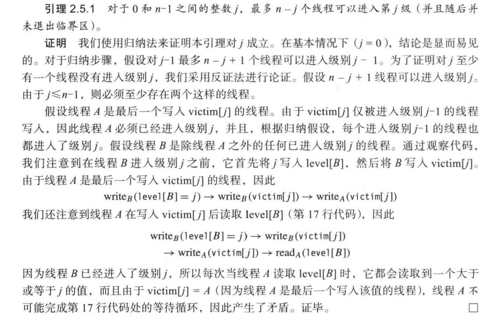

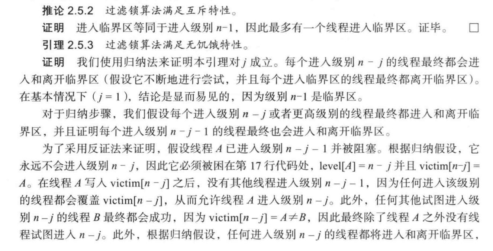


> *简单理解：有 N 层楼，N 个人从第 1 层开始闯。每层最后进来的那个人被  victim 机制困在该层的等待区，其他人继续往上。最终 1 个人到达顶层进入临界区。当顶层的人离开（unlock）时，他就从塔里消失（level 归零），塔里的人数减 1。困在第 N-1 层等待区的人发现楼上没人了，就闯进顶层，然后依次往下连锁触发，所有被困住的人都能往上爬一层。重复上述过程，最终所有人都能到达顶层并离开。*

## 6. 公平性

无饥饿特性保证调用 lock。方法的每个线程最终都会进入临界区，但它不能保证这个过程所需要的时间，也不能保证锁对试图获取它的所有线程都是“公平的”。例如，虽然过滤锁算法满足无饥饿特性，但某个试图获取锁的线程可能会被另一个线程任意多次超越。

理想情况下（非形式化地）， 如果线程 A 在线程 B 之前调用 lock() 方法，那么线程应 A 该在线程 B 之前进人临界区。也就是说，锁应该是“先到先服务”。但是，使用目前介绍的工具，我们无法确定哪个线程先调用 lock() 方法。

为了定义公平性，我们将 lock() 方法的代码分为两个部分：**入口**（ doorway）区和**等待** （waiting）区，其中入口区的代码总是在有限的步骤数内完成，等待区的代码则可能需要无限多个步骤。也就是说，在调用 lock() 方法之后，线程可以在有限步骤数内完成入口区的代码。

确保可以在有限步数内完成的代码段称为**有界无等待**（bounded waitfee）。有界无等待特性是一个很强的进程需求，不包含循环语句的代码可以满足该需求。在后面的章节中，我们将讨论如何在包含有循环语句的代码中提供此特性。根据这个定义，我们定义了以下的公平特性。

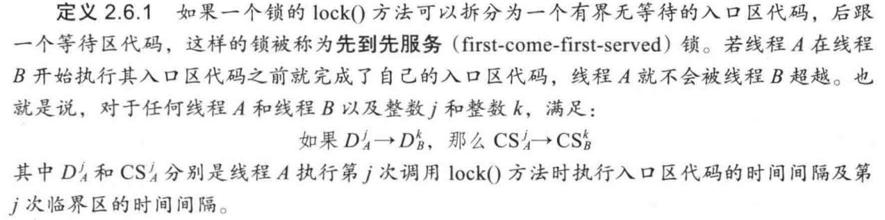

请注意，任何满足无死锁特性和先到先服务的算法也满足无饥饿特性。

## 7. 兰波特的面包房锁算法

对于包含 n 个线程的互斥问题，最优雅的解决方案也许是**面包房（Bakery）锁**算法。如图 2.10 所示。该算法通过使用面包房中常见的取号机的分布式版本来保证“先到先服务” 的特性：每个线程在入口区取得一个序号，然后等待，直到没有具有较早序号的线程试图进入临界区。

```java
class Bakery implements Lock {
    boolean[] flag;
    Label[] label;
    public Bakery(int n) {
        flag = new boolean[n];
        label = new Label[n];
        for (int i = 0; i < n; i++) {
            flag[i] = false;
            label[i] = 0;
        }
    }
    public void lock() {
        int i = ThreadID.get();
        flag[i] = true;
        label[i] = max(label[0],...,label[n-1]) + 1;
        for (int k = 0; k < n; k++) {
            while flag[k] && (label[k], k) << (label[i], i) {}
        }
    }
    public void unlock() {
        flag[ThreadID.get()] = false;
    }
}
```

<p align="center">图 2.10 面包房锁算法的伪代码</p>

在面包房锁算法中，flag[A] 是一个布尔型标志，它表示线程 A 是否想要进入临界区， 而 label[A] 是一个整数，用于表示线程 A 进入面包房时的相对次序。为了获取锁，线程首先将其 flag 标志设置为 true（即升起标志）， 然后读取所有线程的标签值（按任意次序）并生成 一个大于它读取的所有标签的标签值（当前最大标签值 +1 ）。 从调用 lock() 方法到写入新标签值（第 14 行）的这一段代码就是**入口区**（doorway）；入口区代码确立了线程相对于其他试图获取锁的线程的次序。同时执行其入口区代码的任意两个线程都可能会读取到相同的标签值并选择相同的新标签值。为了打破这种对称性，该算法在标签和线程 ID 上定义了一种字 典序 << 来进行大小比较：

```text
label[i] < label[j] 或者 label[i] == label[j] 并且 i < j
```

在面包房锁算法的等待区 (第 15 行代码)，每个线程以任意次序重复读取其他线程的标志和标签值，直到它确定没有一个具有升起标志的线程具有按字典序排列更小的 label/ID 对。

由于释放锁并不会重置 label[]，所以很容易看到每个线程的标签值都是严格单调递增的。有趣的是，在人口区代码和等待区代码处，所有线程可以任意地按异步方式读取标签值。例如，在选择新标签之前所看到的标签集可能从未在同一时刻存在于存储器中。尽管如此，面包房锁算法依然有效。

> 线程读取标签集的过程不是原子的。假设有三个标签 A、B、C，它们的修改顺序是 A -> B -> C，这时有一个线程遍历读取这三个标签可以得到一个标签集：A_Old、B_New、C_Old，很明显这个标签集在内存中从未真实存在过。

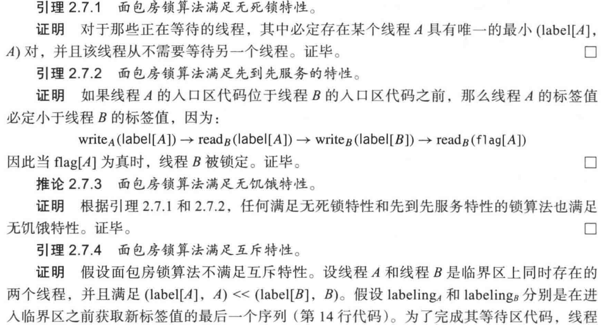

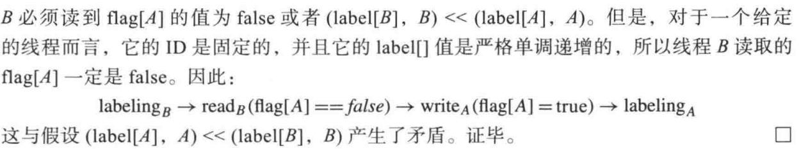

## 8. 有界时间戳

请注意，面包房锁算法的标签值将无限增长，因此在一个长时间运行的系统中，我们不得不考虑溢出问题。如果某个线程的 label 变量在其他线程不知情的情况下从一个大的数字溢出并清零，那么将不再满足先到先服务的特性。

在后续章节中，我们将讨论如何使用计数器对线程排序，甚至可以为每个线程生成唯一的 ID。在实际应用中，溢出问题的严重程度究竟如何？很难一概而论，有的时候其后果非常严重。在 20 世纪的最后几年，著名的 “千年虫”引起了媒体的关注，这是一个真实的溢出问题的典型示例，即使其引发的后果并不像预测的那样可怕。2038 年 1 月 19 日，即自 1970 年 1 月 1 日以来的秒数超过 2^31^ 秒时，UNIX 系统的 time_t 数据结构将溢出。没有人知道这是否会带来严重的后果。当然，有的时候计数器的溢出并不会产生什么大问题。例如，大多 数使用 64 位计数器的应用程序可以持续运行足够长的时间，不太可能会发生这种溢出清零事件（让我们的子孙后代们去担心吧！）。

在面包房锁算法中，标签充当**时间戳**（timestamp）的角色：它们在争用线程之间建立一 个顺序。通俗地说，我们需要确保如果一个线程在另一个线程之后得到一个标签值，那么第二个线程得到的标签值会比第一个线程得到的标签值大。仔细回顾面包房锁算法的代码，可以观察到每个线程需要具备两种能力：

* 读取其他线程的时间戳（**扫描**）。
* 为自己分配一个更晚的时间戳（**标记**）。

实现该时间戳系统的一种 Java 接口如图 2.11 所示。由于有界时间戳系统主要用于实现 Lock 类的入口区代码，所以时间戳系统必须满足无等待特性。构建这样一个无等待的并发时间戳系统是可行的（参见章节注释），但是构建过程比较耗时并且需要一定的技巧。相反，我们选择构建一个**串行**（sequential）的时间戳系统。在该系统中，所有线程严格按照顺序一个接着一个执行**扫描**（scan）操作和**标记**（label）操作，就像每个线程都是使用互斥方式来完成的。换而言之，我们只考虑一个线程可以对其他线程的所有标签执行一次扫描操作， 然后分配一个新的标签。其中每个这样的操作序列（扫描+标记）都是一个单独的原子操作步骤。虽然并发时间戳系统和串行时间戳系统的实现细节差别很大，但它们的基本原理本质上是相同的。

```java
public interface Timestamp {
    boolean compare(Timestamp);
}
public interface TimestampSystem {
    public Timestramp[] scan();
    public void label(Timestamp timestamp, int i);
}
```

<p align="center">图 2.11 一个时间戳系统的接口</p>

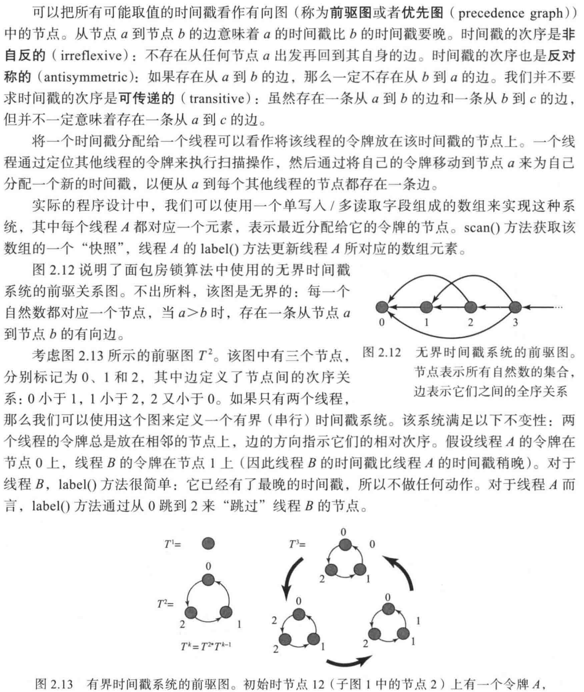

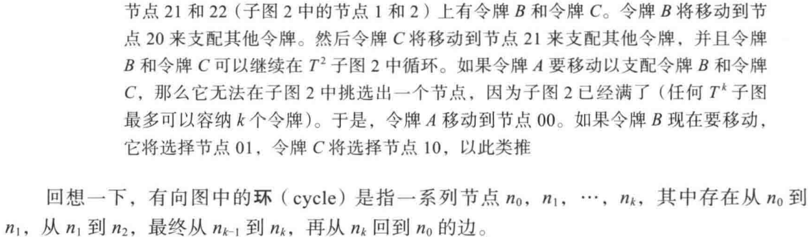

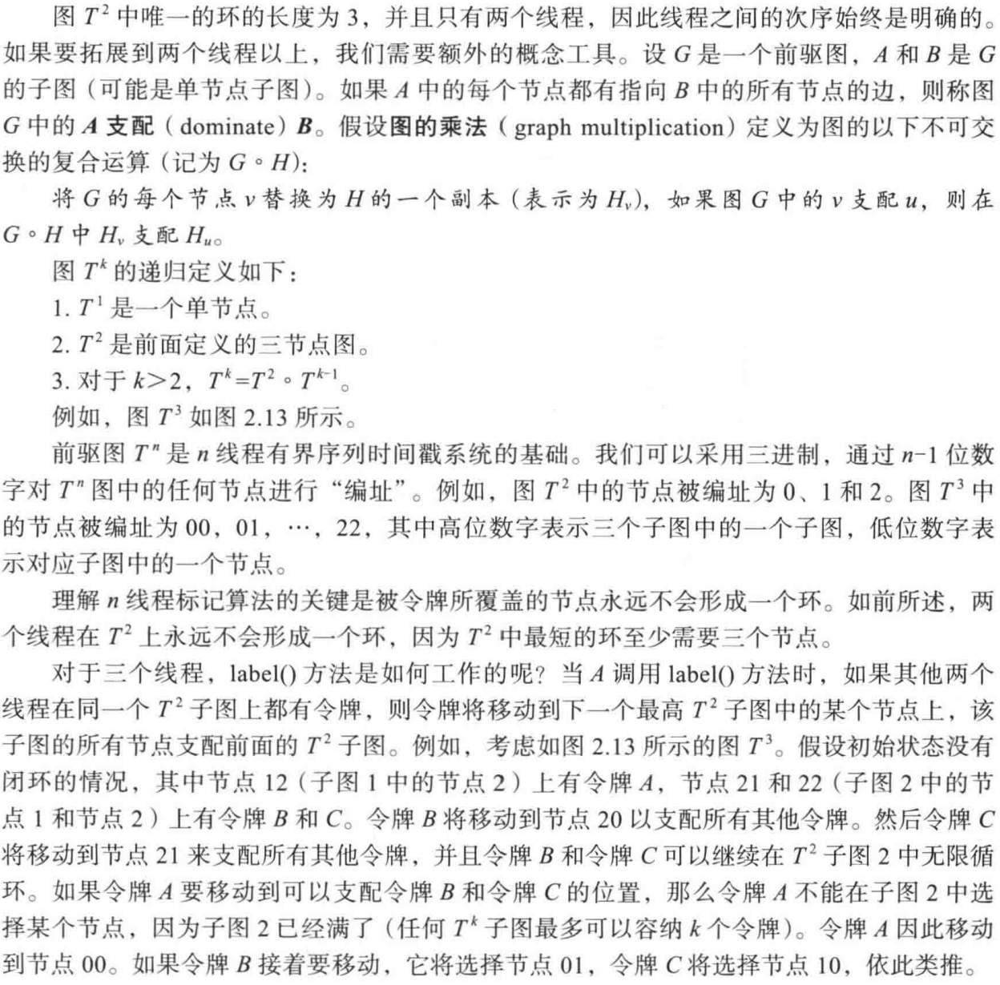

## 9. 存储单元的下界

面包房锁算法具有简洁、典雅并且公平的特性。然而，为什么该算法并不实用呢？其主要缺点是需要读取和写入 n 个不同的存储单元，其中 n 是并发线程的最大数量（可能会非常大）。

否存在一种更好的基于读取和写入存储器并且可以避免这种开销的智能锁算法呢？接下来我们将证明答案是否定的。也就是说，任何满足无死锁特性的互斥算法，在最坏的情况下都需要分配并至少 n 个不同的存储单元。这个结论是至关重要的：它促使我们在多处理器中增加一些比读取和写入更强大的同步操作功能，并将它们作为互斥算法的基础。我们将在后面的章节讨论更实用的互斥算法。

在本节中，我们将研究为什么这种线性边界是互斥问题固有的特性。可以观察到，仅仅由**读取**（read）指令或者**写入**（write）指令（通常称为**加载**（load）和**存储**（store））访问的存储单元具有以下限制：由某个线程写入一个给定存储单元的数据，在其他线程读取其内容之前，可能会被覆盖（overwritten，或者称为重写）。

为了完成证明，首先讨论给定的多线程程序使用的所有存储器的状态。一个对象的状态(state) 就是该对象字段的状态。一个线程的**局部状态** (local state) 就是其程序计数器和局部变量的状态。**全局状态** ( global state) 或者**系统状态**( system state) 包含所有对象的状态以及所有线程的局部状态。

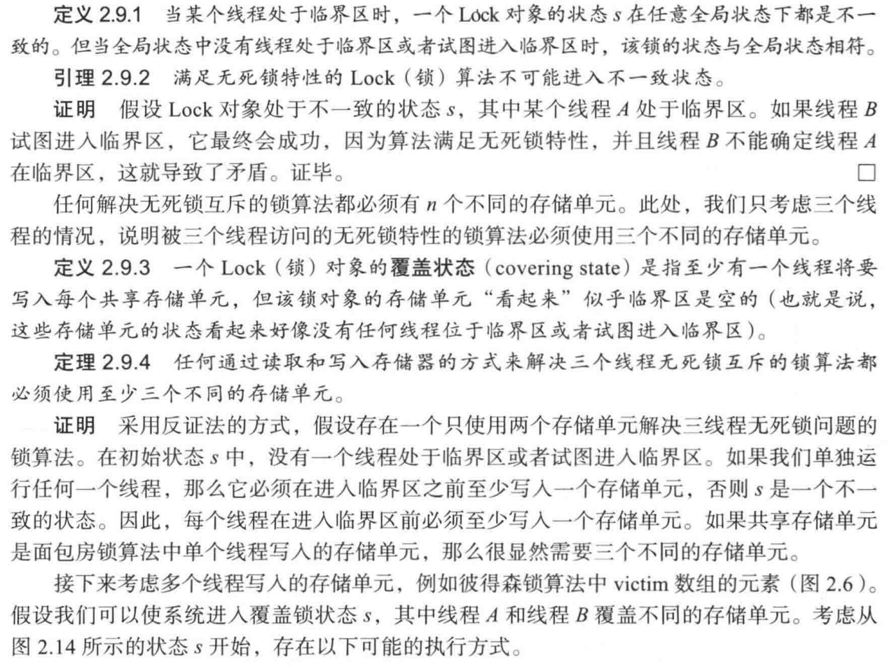

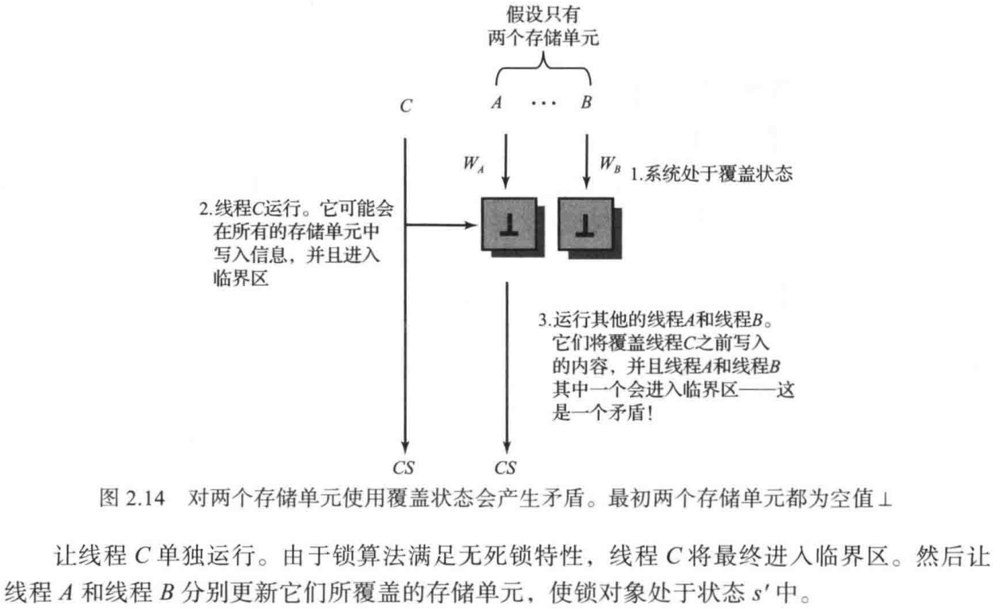

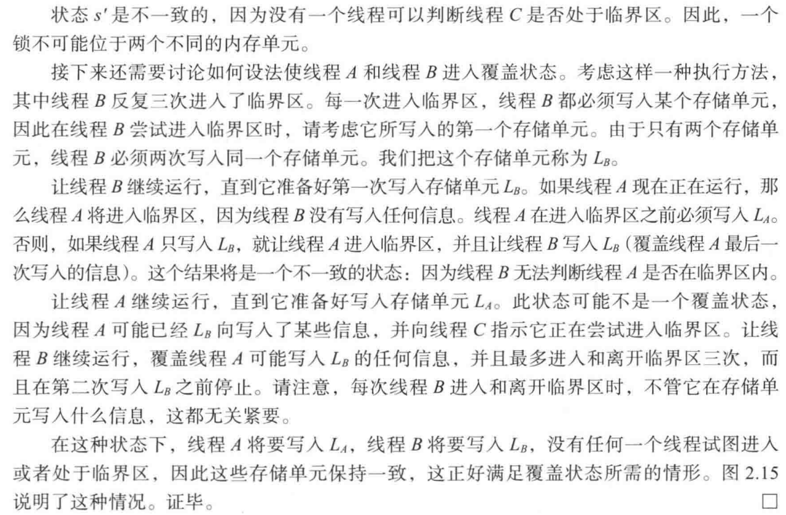

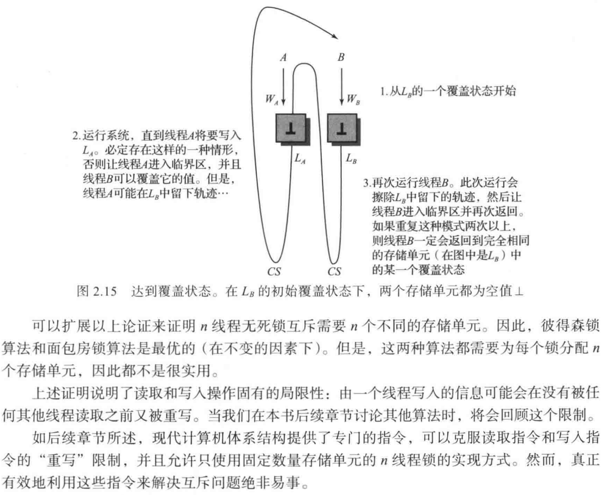

> *例如 RMW（READ MODIFY WRITE）指令。*