+++
title = "《多处理器编程的艺术》 第三章 并发对象"
date = "2026-07-29"
tags = ["multiprocessor-programming", "concurrency", "sc", "qc", "linearizability", "consistency", "correctness", "progress", "wait-free", "lock-free", "obstruction-free", "starvation-free", "deadlock-free", "nonblocking", "blocking"]
+++

<h1 align="center">多处理器编程的艺术</h1>
<h2 align="center">第三章 并发对象</h2>

并发对象的行为可以使用其安全特性和活跃特性来有效地描述，这两个特性通常分别称为**正确性** (correctness) 和**演进性** (progress)。本章将阐述用来刻画并发对象正确性和演进性的各种方法。

虽然并发对象正确性的所有概念都是基于与串行行为等价的概念，但不同的概念适用于不同的系统。下面我们研究三种正确性条件。

**顺序一致性** (sequential consistency) 是一种强制约束条件，通常用于描述诸如硬件存储器接口之类的独立系统。

**线性一致性** ( linearizability) 是一种更强的约束条件，它支持**组合** (composition)，适合描述由**可线性化**的 ( linearizable) 组件所组成的高级系统。

**静态一致性** (quiescent consistency) 适用于在对象行为上施加相对较弱的约束条件从而换取更高性能的应用。

在保证正确性的同时，不同的方法实现提供了不同的演进保证。有些演进保证是**阻塞**式的(blocking)，即一个线程的延迟会影响其他线程的演进；有些演进保证是**非阻塞**式的 (nonblocking)，即一个线程的延迟不能无限期地延迟其他线程。

## 1. 并发性和正确性

并发对象的正确性意味着什么？图 3.1显示了一种简单的基于锁的先进先出 (FIFO) 并发队列。其中，enq() 方法和 deq() 方法采用第2章中介绍的互斥锁来实现同步。从直觉上看这种实现方法应该是正确的：因为每个方法在访问字段和修改字段的整个过程中都持有一个互斥锁 (exclusive lock)，所以这些方法的调用将按顺序依次执行。

```java
class LockBasedQueue<T> {
    int head, tail;
    T[] items;
    Lock lock;
    public LockBasedQueue(int capacity) {
        head = 0;
        tail = 0;
        lock = new ReentrantLock();
        items = (T[])new Object[capacity];
    }
    public void enq(T x) throws FullException {
        lock.lock();
        try {
            if (tail - head == items.length) {
                throw new FullException();
            }
            items[tail % items.length] = x;
            tail++;
        } finally {
            lock.unlock();
        }
    }
    public T deq() throws EmptyException {
        lock.lock();
        try {
            if (tail == head) {
                throw new EmptyExcption();
            }
            T x = items[head % items.length];
            head++;
            return x;
        } finally {
            lock.unlock();
        }
    }
}
```

<p align="center">图 3.1 基于锁的 FIFO (先进先出) 队列</p>

图 3.2 描述了这种队列的实现思想，图中展示了以下执行场景：线程 A 让元素 a 入队, 线程 B 让元素 b 入队；线程 C 执行了两次出队操作，第一次抛出空异常 EmptyException，第二次返回，图中重叠的区间表示并发的方法调用。所有的方法调用在时间上都是相互重叠的。和其他图示相类似，在图 3.2 中时间从左向右移动，黑线表示时间间隔。单个线程的时间间隔沿一条单水平线显示。为了方便起见，线程名称标记在水平线的左侧。条形栅栏表示具有固定起始时间和停止时间的时间间隔。右侧虚线形式的条形栅栏表示具有固定的起始 时间和不确定的停止时间的时间间隔。标记 “q.enq(x)“ 表示线程使得元素 x 在对象 q 中入队，而 ”q.deq(x)” 则表示线程使得元素 x 从对象 q 中出队。

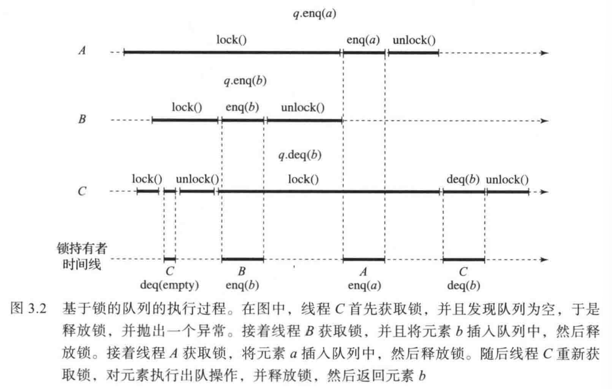

图中的时间线显示哪个线程持有锁。在图 3.2 中，线程 C 首先获取锁，发现队列为空， 于是释放锁，并抛出一个异常。线程 C 不会修改队列。接着线程 B 获取锁，并且将元素 b 插入队列中，然后释放锁。接着线程 A 获取锁，并且将元素 a 插入队列中，然后释放锁。随后线程 C 重新获取锁，对元素 b 执行出队操作并释放锁，然后返回元素 b。所有这些调用都按顺序执行，因此可以很容易地验证元素 b 先于元素 a 出队，这与通常顺序的 FIFO 队列行为的理解是一致的。

令人遗憾的是，阿姆达尔定律（第 1 章）指出，绑定互斥锁的并发对象的方法只能一个接一个地串行执行，因此效率比采用细粒度锁或无锁的对象差。为此，我们需要一种不依赖方法级锁定的方案，用以规范并发对象的行为，并对其实现进行分析推理。

图 3.3 给出了并发队列的另一种实现。它的内部构造与图 3.1 中基于锁的队列几乎相同， 唯一的区别是没有锁。如果只有一个入队线程和一个出队线程，我们可以认为这个实现是完全正确的。然而要解释其中的原因就没有那么简单了。如果该队列支持并发入队或者并发出 队，那么该队列是否满足 FIFO 队列的要求就不得而知了。

基于锁的队列示例说明了一个很有用的原则：如果我们能够以某种方式将并发对象的并发执行映射到串行执行，则只需要对串行执行的行为进行分析推理，从而可以简化对并发对象执行行为的分析推理。这条原则是本章阐述的正确性特性的关键准则。因此，接下来我们首先讨论串行对象的行为规范。

```java
class WaitFreeQueue<T> {
    int head = 0, tail = 0;
    T[] items;
    public WaitFreeQueue(int capacity) {
        items = (T[]) new Object[capacity];
    }
    public void enq(T x) throws FullException {
        if (tail - head == items.length) {
            throw new FullException();
        }
        items[tail % items.length] = x;
        tail++;
    }
    public T deq() throws EmptyException {
        if (tail == head) {
            throw new EmptyExcption();
        }
        T x = items[head % items.length];
        head++;
        return x;
    }
}
```

<p align="center">图 3.3 单入队线程/单出队线程的 FIFO 队列。除了不需要使用锁机制来协调访问之外，其 构造与基于锁的 FIFO 队列基本相同</p>

## 2. 串行对象

在 Java 和 C++ 等程序设计语言中，**对象**（object）是一个包含数据和一组**方法**（method) 的容器，并且规定只能通过对象的方法才能操作对象的数据。每个对象属于某个类（class)，类定义了对象的方法以及其具体的行为表现。对象具有严格定义的**状态** (state)，例如 FIFO 队列的当前元素序列。有很多方式可以描述对象方法的行为，例如形式化的规范说明，甚至直观的自然语言。我们日常使用的应用程序接口（API）文档是介于两者之间的一种方式。

API 文档通常采用以下描述方式：如果对象在调用方法之前处于某个状态，那么当方法调用返回时，对象将处于某个其他的状态，并且方法调用将返回一个特定的值，或者抛出一个特定的异常。很显然，这种描述可以分为**前置条件**（precondition）和**后置条件** (postcondition)，前置条件描述方法调用前对象的状态，后置条件则描述方法返回时对象的状态和返回值。对象状态的变化有时称为**副作用**（side effect）。

例如，FIFO 队列可以采用以下描述方式：该类提供两个方法 enq() 和 deq()。队列状态是其中元素的序列，也有可能为空。如果队列的状态是一个序列 q（前置条件）， 那么调用 enq(z) 方法将使队列的状态变为 q - z（具有副作用的后置条件），其中 “-” 表示串联。如果队列对象是非空的（前置条件），其状态记作 a - q，那么 deq() 方法将删除该序列中的第一个元素 a，使队列处于状态 q，并且返回元素 a（后置条件）。相反，如果队列对象为空（前置条件），则该方法将抛出一个 EmptyException 异常并保持队列的状态不变（后置条件没有副作用）。

这种类型的说明文档称为**顺序规范说明**（sequential specification），该规范说明十分常用，具有简单优雅、功能强大的特点。由于每个方法都需要单独描述，因此对象文档的长度与方法的数量呈线性关系。各个方法之间存在大量潜在的交互（一个方法可以会调用另一个方法）。所幸，这些交互可以通过方法对对象状态的副作用来简洁描述——只需关注每次方法调用之前和之后的对象状态，而调用过程中可能出现的任何中间状态都可以安全忽略。

在单线程串行计算模型中，用前置条件和后置条件来描述对象行为是自然而有效的做法。然而，对于多线程共享的对象，这种方法就不再适用了——因为方法调用会在时间上相互重叠，讨论其执行顺序失去了意义。例如，在一个多线程程序中，如果元素 x 和 p 在重叠的时间间隔内入队到 FIFO 队列中，结果将是什么呢？哪一个会先入队？问题在于：我们能否继续用前置/后置条件独立描述每个方法？还是必须明确刻画多次并发调用之间的各种可能交互？

在这种情况下，连对象状态的概念也变得模糊不清。在单线程程序中，我们通常假定对象在方法调用之间存在着一个有意义的中间状态；但在多线程程序中，重叠的方法调用随时可能都在进行，并发对象几乎不会处于方法调用之间的某个状态。每个方法调用都必须面对因其他并发调用而产生的不完全结果所影响的对象状态——而这个问题在单线程程序中不会发生。

## 3. 顺序一致性

为了直观地理解并发对象的执行行为，可以采用以下方法：考察一些简单对象的并发执行的实例，并分析在各种情况下其行为是否与我们直觉上预想的并发对象行为相一致。

方法的调用需要执行时间。**方法调用** (method call) 是从**调用** (nvocation) 事件开始并持续到相应的**响应**（response）事件（如果有）的一段**时间间隔**。并发线程的方法调用可能相互重叠，而单个线程的方法调用总是按顺序串行执行（无重叠，一个接着一个）。如果一个方法的调用事件已经发生，但是它的响应事件还没有发生，我们称这个方法调用是**挂起的** (pending)。

出于一些历史原因，通常将一个读写存储单元所对应的对象版本称为**寄存器**（register，参见第4章）。在图 3.4 中，两个线程分别将 -3 和 7 并发写入共享寄存器 r（如前所述，`r.read(x)` 表示从寄存器 r 中读取 x，`r.write(x)` 表示向寄存器 r 写入 x）。随后，某个线程读取 r 并返回 -7，这显然有悖于直觉——我们期望寄存器的值要么是 7，要么是 -3，而不应是两者的混合。根据该示例我们提出以下原理：

**原理 3.3.1**  所有的方法调用都遵循一次只调用一个方法，并且按顺序串行执行的原则。

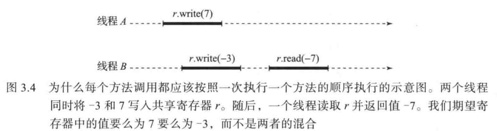

由于这个原理本身约束性太弱，所以并不实用。例如，该原理允许读取操作总是返回对象的初始状态。

现在考虑图 3.5 中的执行情况，其中一个线程先向共享寄存器 r 中写入 7，然后写入 -3。之后，它读取 r 并返回 7。对于某些应用程序，此行为不符合期望，因为线程读取的值不是它最近写入的值。一个单线程的方法调用顺序称为该线程的**程序次序** (program order)。在本例中，操作的调用并没有按照程序次序执行，这不符合我们的预期。根据该示例我们继续提出以下原理：

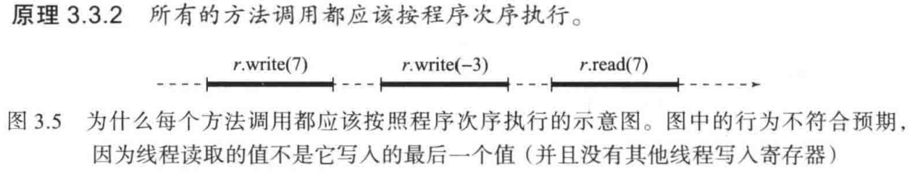

这一原理确保纯粹的顺序计算按照我们期望的方式进行。原理 3.3.1 和原理 3.3.2 共同定义了**顺序一致性** (sequential consistency)，这是一个在多处理器同步的相关文献中广泛使用的正确性条件。

顺序一致性要求方法调用的执行顺序与程序次序一致。也就是说，对于任何并发执行，总存在一种对全部方法调用的排序方式，使得这种排序满足：

1. 与程序次序相一致；
2. 符合对象的顺序规范说明。

可以存在多个满足这些条件的方法调用次序。例如，在图 3.6 中，线程 A 将元素 x 入队，同时线程 B 将元素 y 入队，然后线程 A 将元素 y 出队，同时线程 B 将 x 出队。存在两种都可以满足上述结果的执行次序：

1. 线程 A 入队 x，线程 B 人队 y，线程 B 出队 x，线程 A 出队 y；
2. 线程 B 入队 y， 线程 A 入队 x，线程 A 出队 y，线程 B 出队 x。

这两种执行次序都与程序次序相一致，每一种执行都符合顺序一致性。

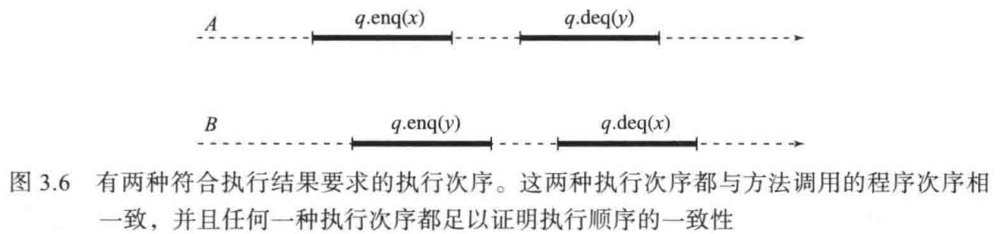

### 3.1 顺序一致性与实时次序

在图 3.7 中，线程 A 将对象 x 入队，然后线程 B 将对象 y 入队，最后线程 A 将对象 y 出队。这种执行顺序可能违背我们对 FIFO 队列运行方式的直观理解：将对象 x 入队在将对象 y 入队开始之前已经完成，因此对象 y 在对象 x 之后入队，但是对象 y 却在对象 x 之前出队。尽管如此，这种执行方式满足顺序一致性。虽然对象 x 入队的调用发生在让对象 y 入队的调用之前，但是这些调用与程序次序并不相关，因此顺序一致性可以自由地对它们重新排序。 

当一个操作在另一个操作开始之前完成时，**实时次序** (real-time order) 规定：第一个操作应该在第二个操作之前。这个例子表明，顺序一致性不需要保持实时次序。

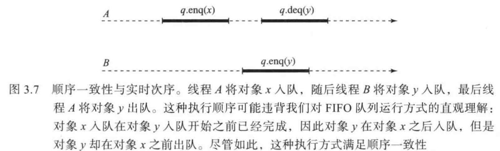

人们可能会讨论是否可以对时间间隔不重叠的方法调用 (即使发生在不同的线程中) 进行重新排序。例如，我们在星期一存入工资收入支票，但银行在星期五退回了我们的租金支付支票，因为银行把存款支票重新安排在租金支付支票的后面，这样就会给我们造成麻烦和带来不愉快。

### 3.2 顺序一致性是非阻塞的

顺序一致性在多大程度上限制了并发性？具体来说，在什么情况下，顺序一致性要求一个方法调用阻塞，并等待另一个方法调用完成？

结果也许会出人意料，答案是 (基本上) 永远不会阻塞：更准确地说，对于满足顺序一致性的并发执行，任何挂起的方法调用都对应一个满足顺序一致性的响应，也就是说，可以在不违反顺序一致性的情况下立即给出对方法调用的响应。具有这个特性的正确性条件是**非阻塞**的 (nonblocking)。显然，顺序一致性是一个非阻塞的 (nonblocking) 正确性条件。

请注意，上述结论并不意味着很容易为挂起的方法调用找出满足顺序一致性的响应，只是正确性条件本身并不妨碍这一点。该结论仅适用于为每个对象状态定义的完全方法 (total method)，即对于调用完全方法的任何状态，总是存在顺序规范说明允许的某种响应。 当然，如果没有满足顺序规范说明的响应，就没有对方法调用的顺序一致性响应。

到目前为止，我们对顺序一致性的非形式化描述还不足以精确描述这一点以及其他重要细节，例如， 对于具有挂起的方法调用的执行而言，顺序一致性到底意味着什么。我们将在 3.6 节中进一 步阐明这个概念。

### 3.3 可组合性

任何比较复杂的系统都必须以**模块化** (modular) 的方式来设计和实现，并且需要独立地设计、实现和验证各个组件。每个组件都必须明确区分其**接口** (interface，描述组件对其他组件的保证) 和实现 (implementation，对用户隐藏)。例如，如果一个并发对象的接口声明它是一个满足顺序一致性的 FIFO 队列，那么使用该队列的用户不需要知道队列具体的实现方式，只需要使用接口对各个正确的组件进行组合，并且其组合结果本身应该也是一个正确的系统。

当系统中的各个对象都满足正确性特性 P 时，如果系统作为一个整体也满足 P，那么正确性特性 P 称为**可组合**的 (compositional)。可组合性非常重要，因为它允许通过独立的组件简单地组装系统。基于非组合的正确性特性的系统不能仅仅依赖于其组件的接口，还需要某种附加的约束来确保组件实际上的兼容性。

顺序一致性满足可组合性吗？换而言之，把多个满足顺序一致性的对象组合起来，其结果本身是否也满足顺序一致性？令人遗憾的是，答案是否定的。在图 3.8 中，两个线程 A 和 B 分别调用两个队列对象 p 和 q 的入队方法和出队方法。不难看出，队列对象 p 和 q 都满足顺序一致性：p 的方法调用顺序与图 3.7 所示的顺序一致执行中的方法调用顺序相同，并且 q 的行为是对称的。但是，作为一个整体的执行行为并不满足顺序一致性。

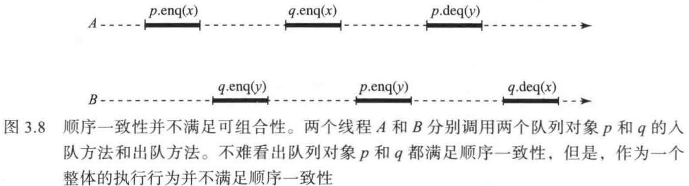

接下来我们采用反证法，证明这些方法调用不存在与程序次序相一致的正确顺序执行方式。我们使用以下简便符号〈p.enq(x) A〉->〈p.deq(x) B〉来表示对于任何顺序执行而言，都必须遵循以下顺序：线程 A 对对象 p 的入队 x 操作先于线程 B 对对象 q 的出队 x 操作，以此类推。因为对象 p 是 FIFO 队列，并且线程 A 从 p 中出队 y，所以 y 必须在 x 之前在 p 中入队：

```text
(p.enq(y) B) -> (p.enq(x) A)
```

同理，队列对象 x 必须在 y 之前在 q 中入队：

```text
(q.enq(x) A) -> (q.enq(y) B) 
```

然后，根据程序次序我们有：

```text
(p.enq(x) A) -> (q.enq(x) A) 并且 (q.enq(y) B) -> (p.enq(y) B)
```

综上所述，这些排列次序形成了一个环：

```text
(p.enq(y) B) -> (p.enq(y) B)
```

显然，一个事件不可能发生在其本身之前，因此该并发执行不符合顺序一致性。

## 4. 线性一致性

顺序一致性存在一个严重的缺陷：它不满足可组合性。也就是说，将多个顺序一致的组件进行组合，其结果本身并不一定满足顺序一致性。为了解决这个问题，方法调用与程序次序相一致的前提条件需要替换为以下更强的约束条件：

**原理 3.4.1**  每个方法调用都应该在调用和响应之间的某个时刻立即生效。

这个原理指出，必须保持方法调用的实时次序。我们称这种正确性特性为**线性一致性** ( linearizability ) 。每个可线性化的执行都满足顺序一致性，但反之则不然。

### 4.1 可线性化点

为了说明一个并发对象的实现是可线性化的，常用方式是把每个方法识别为一个**可线性化点 **( linearization point)，用于表示该方法生效的瞬间。方法在它的线性化点上被**线性化** ( linearized)。

> *对于基于锁的实现，每个方法的临界区内的任何点都可以作为其可线性化点。对于不使用锁的实现，可线性化点通常是该方法调用的效果对其他方法调用可见的单个步骤。*

例如，回顾图 3.3 中的单入队线程/单出队线程队列。这种实现没有临界区，但我们可以确定这个方法的可线性化点。例如，如果一个 deq() 方法返回一个元素，那么它的可线性化点就在 head 字段被更新时 (第 17 行代码)。如果队列为空，则 deq() 方法在读取 tail 字段 (第 14 行代码) 时被线性化。enq() 方法的分析与之类似。

### 4.2 线性一致性和顺序一致性

与顺序一致性相类似，线性一致性也是非阻塞的：对一个完全方法的任何挂起调用都有一个可线性化的响应。因此，线性一致性不会限制并发性。

仅通过单个共享对象（例如共享内存）进行通信的线程，无法区分顺序一致性与线性一致性。只有能够观察到操作之间实时次序的外部观察者，才能判断顺序一致的对象是不可线性化的。因此，顺序一致性与线性一致性之间的差异有时也被称为**外部一致性**（external consistency）。在无需考虑组合的独立系统中，顺序一致性是一种合适的选择。然而，当线程共享多个对象时，这些对象之间可能互为外部观察者，如图3.8所示。

与顺序一致性不同，线性一致性满足可组合性：将多个可线性化对象进行组合后，其结果也是可线性化的。因此，线性一致性是描述大规模系统组件的好方法。在大规模系统中， 各个组件必须独立实现和验证。因为我们关注的是组合系统，所以本书中讨论的大多数 (但不是所有) 数据结构都是可线性化的。

## 5. 静态一致性

对于某些系统，实现者可能愿意牺牲一致性来换取性能的提升。也就是说，我们可以放宽一致性条件，以获得更便宜、更快速或更高效的实现。放松一致性条件的一种方法是，仅当对象处于**静态** (quiescent) 时 (也就是说，当对象没有挂起的方法调用时) 才强制按次序执行。我们将采用以下原理代替原理 3.3.2 和原理 3.4.1：

**原理 3.5.1**  由一段静态时间分隔的若干方法调用必须按照其实时次序执行。

例如，假设线程 A 和 B 在 FIFO 队列中同时将对象 x 和 y 入队。随后队列处于静态，然后线程 C 将对象 z 入队。我们无法预测队列中对象 x 和 y 的相对次序，但我们知道它们位于对象 z 之前。

原理 3.3.1 和原理 3.5.1 共同定义了一个称为**静态一致性** (quiescent consistency) 的正确性特性。通俗地说，只要对象处于静态状态，到目前为止的执行就相当于已完成调用的某个顺序执行（不一定满足实时顺序）。

以第1章中讨论的共享计数器为例。满足静态一致性的共享计数器，其返回的数字序列虽然不一定符合 `getAndIncrement()` 的调用顺序，但不会出现重复或遗漏。

可以将静态一致性类比为**抢座位游戏**（game of musical chairs）：音乐播放期间，参与者可以自由活动；但音乐随时可能停止，此时系统进入静止状态，每个挂起的方法调用都必须返回一个索引，使得所有已返回的索引**共同满足**顺序计数器的规范——即不重复、不跳数。

换句话说，静态一致计数器本质上是一种**索引分发**（index distribution）机制，适用于那些不关心索引发布顺序、只将其用作循环计数器的程序。

### 5.1 静态一致性的特性

请注意，顺序一致性和静态一致性没有可比性：存在非静态一致的顺序一致性执行，反之亦然。静态一致性并不一定保持程序次序，并且顺序一致性不受静态周期的影响。另一方 面，线性一致性强于静态一致性和顺序一致性。也就是说，可线性化对象既是静态一致的又是顺序一致的。

> *假设对象符合静态一致性。线程 A 有两个操作 A0 -> A1，线程 B 有一个操作 B0，A0、A1 分别与 B0 重叠，则执行 A1 时对象不处于静态，A1 可以排在 A0 的前面，因此静态一致性并不一定保持程序次序。*
>
> *假设对象符合顺序一致性。线程 A 有一个操作 A0，B 有一个操作 B0，A0 -> B0，执行 B0 是对象处于静态，但是 B0 可以排在 A0 的前面，因此顺序一致性并不一定符合静态一致性。*

与顺序一致性和线性一致性一样，静态一致性是**非阻塞**的：在一个满足静态一致性的执行中，对完全方法的任何挂起调用都可以完成。

静态一致性满足可组合性：由若干静态一致性对象组合而得的系统本身就是静态一致的。因此，可以将若干静态一致性对象进行组合来构造更复杂的静态一致性对象。值得进一 步研究的是，我们是否可以使用静态一致性而不是线性一致性作为基本的正确性特性来构建有用的系统，以及这种系统的设计与现有的系统设计有何不同之处。

## 6. 形式化定义

接下来我们讨论更精确的定义。我们重点讨论线性一致性的形式化定义，因为它是本书中涉及最多的并行特性。为静态一致性和顺序一致性提供类似的形式化定义，则作为练习留给读者。

非形式化而言，**如果并发对象的每个方法调用在其调用和返回事件之间的某个时刻立即生效，那么该并发对象是可线性化的**。对于大多数非形式化的推理过程，这种描述已经满足要求。但是对于更加细致的情形 (例如对于那些尚未返回的方法调用)，则需要更精确的形式化定义，以满足更严谨的论证方式。

### 6.1 历史记录

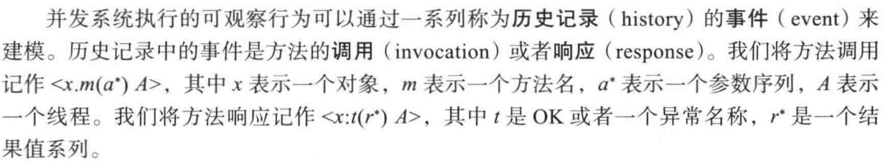

如果一次调用和一个响应具有相同的对象和线程，则称这个响应匹配这次调用。如果历史记录 H 中的一次调用没有相匹配的响应，则该调用处于**挂起状态** (pending)。历史记录 H 中的**方法调用** (method call) 是一个二元组，由一个调用和 H 中的下一个匹配响应或者特殊的 _L 值 (读作“bottom”，如果方法调用被挂起，则意味着没有后续相匹配的响应) 构成。 如果某个**调用** (invocation) 处于挂起状态，则称该**方法调用** (method call) 处于挂起状态， 否则该方法调用处于**完成状态** (complete)。如果一个历史记录中的所有方法调用都处于完成状态，那么该历史记录处于完成状态。对于历史记录 H，我们使用 complete(H) 表示包含完成状态的方法调用的所有事件 (即省略 H 中所有挂起的调用)。

历史记录 H 中的方法调用的**时间间隔** (interval) 是从其调用开始到响应结束之间的所有历史记录事件序列。但是如果方法调用挂起，则是指从调用开始的 H 末尾的历史记录系列。 如果两个方法调用的间隔重叠，则方法调用也会重叠。

如果历史记录的第一个事件是一个调用，并且每个调用 (可能最后一个除外) 后面紧跟着一个相匹配的响应，并且每个响应前面紧跟着下一调用，则称该历史记录为**顺序的 **(sequential)。顺序历史记录中不存在重叠的方法调用，并且顺序历史记录最多包含一个挂起的调用。

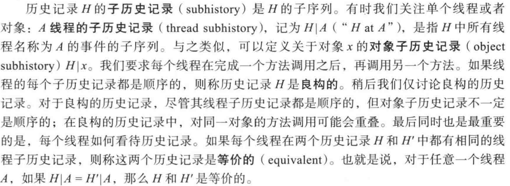

如何判断一个并发对象的正确性呢？ 或者换而言之，如何定义一个并发对象的正确性？基本思想是要求并发执行在某种意义上等价于某些顺序历史记录。对于不同的正确性特性，等价的确切意义有所差别。我们假设可以判断顺序对象的正确性，也就是说，可以判断顺序对象的历史记录是否是对象类的合法历史记录。对象的**顺序规范说明** ( sequential specification) 就是该对象的一个合法顺序历史记录的集合。如果每个对象的子历史记录对该对象是合法的，则顺序历史记录 H 也是合法的。

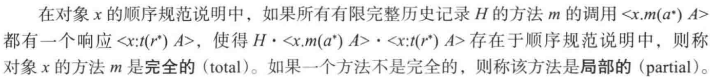

### 6.2 线性一致性

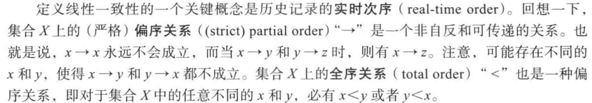

任何偏序关系都可以推广到全序关系。

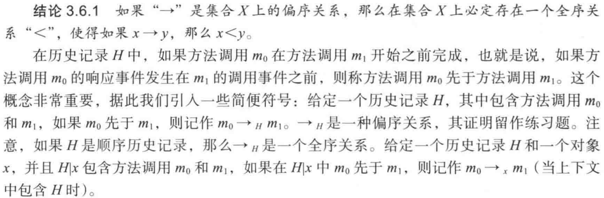

对于线性一致性而言，其基本规则是，如果一个方法调用先于另一个方法调用，则前一个调用必须在后一个调用之前生效 (每个调用必须在其时间间隔内线性化，并且前一个调用的时间间隔完全在后一个调用的时间间隔之前)。相反，如果两个方法调用相互重叠，那么它们的次序是不明确的，因此可以以任何方便的方式对它们进行排序。

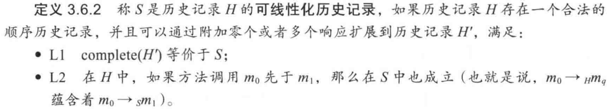

如果 H 存在可线性化历史记录，则称 H 是**可线性化的**。

通俗地说，将"扩展到 "‘表示一些挂起的调用可能已经生效，即使它们的响应尚未返回给调用者。图 3.9 说明了这种概念：我们必须先完成挂起的方法调用 enq(x)，以确保方法调用 deq()返回 x。第二个条件表示，在原始历史记录中如果一个方法调用先于另一个方法调用，那么在线性化操作中必须保留这种次序。

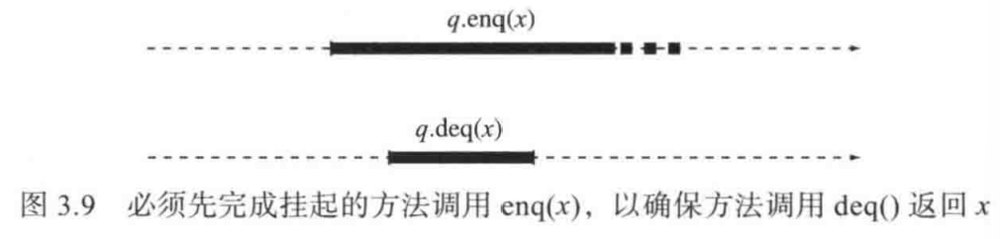

### 6.3 线性一致性满足可组合性

线性一致性满足可组合性。

**定理 3.6.3**  对于历史记录 H 和任意对象，当且仅当 H|x 是可线性化的，H 才是可线性化的。

**证明**  “仅当”部分的证明留作练习题。

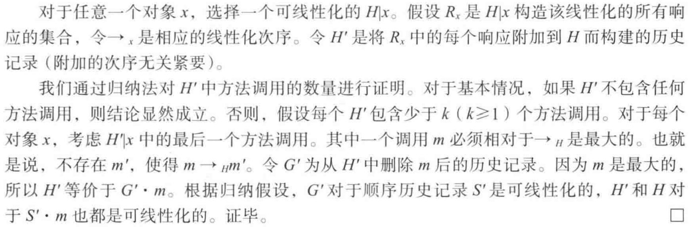

### 6.4 线性一致性是非阻塞的

线性一致性是一种非阻塞 (nonblocking) 特性：一个完全方法的挂起调用不需要等待另 一个挂起调用的完成。

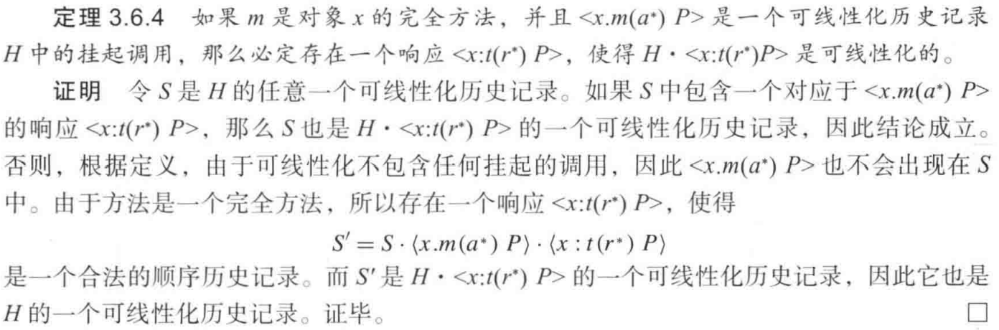

定理 3.6.4 表明，线性一致性本身并不会强制一个完全方法的挂起调用的线程被阻塞。 当然，阻塞 (甚至死锁) 可能作为线性一致性的特定实现中的一个因素而出现，但不是正确性特性本身所固有的，这个定理表明，对于并发性和实时响应要求很高的系统，线性一致性是一个衡量正确性的合适特性。

非阻塞特性并不排除那些以显式方式说明的阻塞情况: 例如，一个线程试图对一个空队列执行元素出队操作时，就有必要阻塞该线程，直到另一个线程将一个元素加入队列：为了说明该意图，队列规范说明中可以将 deq() 方法定义为局部方法：当将该方法应用于一个空队列时，其执行操作不需要定义 ，对于部分顺序规范说明，最自然的并发解释就是使调用一直等待，直到对象达到一个该方法调用的响应被定义了的状态。

## 7. 内存一致性模型

我们可以把一个程序读写的内存看作一个单一的对象，它是由程序所有线程共享的多个寄存器组成的。这种共享存储通常是线程间通信的唯一方式（也就是说，线程可以观察到其他线程运行效果的唯一方式）。 它的正确性特性称为**内存一致性模型**（memory consistency model，或称存储一致性模型），简称**内存模型**（memory model，或称存储模型）。

早期的并发程序假定内存是顺序一致的。事实上，引人顺序一致性的概念来捕捉那些程序中隐含的假设。然而，大多数现代多处理器系统的内存并不是顺序一致的：编译器和硬件可能以复杂的方式对内存读写进行重新排序。因为绝大多数读写操作并不是用于同步操作的，因此大多数时候无法保证顺序一致的内存、这些系统还提供了抑制重新排序的同步原语。

在本书的第一部分中，我们将遵循这种方法，重点介绍多处理器程序设计的原理。例如，第 2 章中各种锁算法的伪代码都基于以下假设：如果一个线程依次连续写入两个存储单元，那么这两次写人将以相同的顺序对其他线程可见，因此任何看到后面写入的线程也将看到前面的写入。但是，Java 不能保证普通读取和写人的顺序。正如“程序注释 2.3.1” 所述，这些存储单元需要声明为 volatile 才能在实际系统中正常使用。我们省略了这些声明，因为这些算法并没有应用于任何实际情形，而且这些声明会降低代码的可读性，并模糊算法中所包含的思想。在本书的第二部分，我们将讨论算法的实际使用，因此代码中将包括这些声明。

>我们在附录 A.3 节中描述了 Java 存储模型。

## 8. 演进条件

线性一致性的非阻塞特性（以及顺序一致性和静态一致性）确保任何挂起的方法调用都有一个正确的响应。但是线性一致性并没有说明如何计算这样的响应，甚至根本没有要求提供实现方法来产生一个响应。例如，考虑图 3.1 所示的基于锁的队列。假设队列的初始状态为空，线程 A 在将对象 x 入队的中途发生了中断并持有锁，随后线程 B 调用 deq() 方法。非阻塞特性要求确保线程 B 的 deq（）方法调用必须有一个正确的响应。实际上，有两种可能的响应：抛出一个异常，或者返回 x。但是在这个实现中，线程 B 无法获取锁，结果只要线程 A 被延迟，那么线程 B 也将被延迟。

这种实现称为**阻塞**（blocking），因为一个线程的意外延迟会阻止其他线程的演进。而在多处理器中，线程的意外延迟十分常见。一个缓存未命中可能会使处理器延迟上百个指令周期，一个页面错误可能会导致几百万个指令周期的延迟，操作系统的抢占可能会导致数以亿 计个指令周期的延迟。具体的延迟取决于计算机和操作系统的情况。系统中决定线程何时执行的部件称为**调度程序**（scheduler），线程执行的次序称为**调度**（schedule）。

在本节中，我们将考虑**演进条件**（progress condition），它要求提供具体的实现方法来生成对挂起调用的响应。理想情况下，我们可能会说每个挂起的调用都会得到一个响应。当然，如果存在挂起调用的线程停止执行，很显然不可能得到响应。因此，只需要确保一直在执 行的那些线程能够演进。

>*演进条件（Progress Condition）是并发系统的一种活性属性（Liveness Property），它规定了在什么情况下，系统中的操作（方法调用）能够在有限时间内完成其执行。*

### 8.1 无等待性

如果一个对象实现方法的所有调用执行都可以在有限的步骤内完成，则该方法的实现是**无等待的**（wait-free）。也就是说，对于一个无等待方法的挂起调用的线程，如果该线程可以继续执行，则它必将在有限的步骤内完成。如果一个对象实现的所有方法都是无等待的，那 么这个对象的实现就是无等待的，如果一个类的每个对象都是无等待的，那么这个类就是无等待的。

图 3.3 所示的队列是无等待的。例如，如果线程 B 调用 deq() 方法，而线程 A 在将 x 入队的中途发生了中断，则线程 B 要么抛出一个 EmptyException 异常（如果线程 A 在递增 tail 字段之前发生中断）， 要么返回 x（如果线程 A 在递增 tail 字段之后发生中断）。相反，基于锁的队列不是无等待的，因为线程 B 可能会采取无限次的步骤尝试获取锁，但始终没有成功。

### 8.2 无锁性

无等待性可以确保每个线程在有限的步骤内取得演进，因而具有一定的吸引力。然而， 无等待性算法可能效率不高，有时候需要选择一个较弱的演进保证条件。

放宽演进条件的一种方法是只保证**某些**线程的演进，而不是保证**所有**线程的演进。对于 一个对象实现的方法，如果方法的**某些**调用可以在有限的步骤内完成其执行，则该方法的实现是**无锁的**（lock-free）。而对于一个无等待方法的挂起调用的线程，如果该线程继续执行，则该对象的某些挂起调用（不一定是无锁的方法）将在有限的步骤内完成。

如果一个对象实现的所有方法都是无锁的，那么这个对象的实现就是无锁的。无锁性保证了**最小的演进**（minimal progress），因为执行无锁的方法可以保证系统作为一个整体取得演进，但不能保证任意特定的线程取得演进。相反，无等待性保证了**最大的演进**（maximal progress）：每一个不断执行的线程都会取得演进。

显然，任何满足无等待性的方法实现也是无锁的，但反之则不然。虽然无锁性比无等待性弱，但是如果程序只执行有限个方法调用，那么该程序的无锁性等价于无等待性。

> *假设只有 N 个调用，lock-free 保证至少有一个调用能够有限步骤内完成，那么完成之后就只剩 N - 1 调用了，而这 N - 1 个调用最终也必然能够完成，因此如果只执行有限个方法调用 lock-free 等价于 wait-free。*

无锁性允许某些线程处于饥饿状态。作为一个实际问题，有许多情况下，虽然可能会产生饥饿，但是其概率非常小。因此一个快速的无锁性算法可能比一个较慢的无等待性算法更好。我们将在后续章节中讨论若干满足无锁性的并发对象。

无锁性也是一种非阻塞的演进条件：只要系统作为一个整体执行，那么延迟的线程就不会阻止其他线程取得演进。

### 8.3 无阻塞性

另一种放宽演进条件的方法是仅在有关线程调度方式（即线程执行的次序）的特定假设下保证线程的演进。例如，只有在没有其他线程干预的情况下，具体的实现才能保证线程的演进。如果某个线程在某个时间间隔内执行时再没有其他线程执行，则称该线程在该时间间隔内**独立**（in isolation）执行。如果一个对象实现的方法从任何一点开始独立执行并且在有限的步骤中完成，则称该方法实现是**无阻塞的**（obstruction-free，或称**无障碍的**）。 也就是说，如果一个线程对一个无阻塞方法的一个挂起的调用从任何一点开始（不必从它的调用） 独立执行，则它将在有限的步骤中完成执行。

与其他非阻塞演进条件一样，无阻塞性确保线程不会被其他线程的延迟所阻塞。无阻塞性保证每一个独立执行线程的演进，所以和无等待性一样，它保证了最大的线程演进。

无阻塞性通过调度一个线程独立执行（即防止其他线程同时执行）来确保演进，这似乎与大多数操作系统的调度程序不相符合，操作系统通常尝试执行公平调度，以确保每个线程都将执行。然而，在实践中，这并不是问题。确保无阻塞方法的线程不需要暂停所有其他线程，而只需要暂停那些有冲突的线程，也就是那些在同一对象上执行方法调用的线程。 

在后续章节中，我们将考虑各种**争用管理技术** ( contention management technique)，以减少或者消除有冲突的并发方法调用。实现争用管理技术的一种简单方法是引人一种被称为**退避**( back-off) 的机制：检测到冲突的线程将自动暂停，以便较早的线程有时间完成任务。第 7 章将详细讨论选择何时退避，以及退避多长时间。

### 8.4 阻塞演进条件

在第 2 章中，我们定义了有关锁实现的两个演进条件：**无死锁性**和**无饥饿性**。无死锁性与无锁性相类似，而无饥饿性与无等待性相类似。无死锁性确保某个线程取得演进，而无饥饿性则确保每个线程取得演进，当然前提条件是**锁不被其他线程所持有**。

这里需要特别强调的是，前提条件“锁不被其他线程所持有” 是必要的，因为当一个线程持有锁时，没有任何一个其他线程可以在不违反互斥 (锁的正确性特性) 的情况下获取锁。为了保证线程演进，我们还必须假设持有锁的线程最终会释放锁，这个假设由两个部分构成：

1. 每个获得锁的线程都必须在有限的执行步骤之后释放锁；
2. 调度程序必须允许持有锁的线程继续执行。

通过对执行方法调用的线程进行类似的假设，我们可以将无死锁性和无饥饿性推广到并发对象。具体来说，假设调度程序是公平的，也就是说，它允许每个具有挂起的方法调用的线程执行。

> 假设的第一部分必须由并发对象的实现来保证。

只要具有挂起的方法调用的线程**在执行**，并且对象的方法执行将在有限的步骤内完成，那么对象的方法实现就是**无饥饿**的 (starvation-free)。只要具有挂起的方法调用的线程**在执行**，并且对象的某个方法调用将在有限的步骤内完成，那么对象的方法实现就是**无死锁**的 (deadlock-free)。

当操作系统保证每个线程不断地执行操作步骤，特别是每个线程**按时** (in a timely manner) 地执行操作步骤时，无死锁性和无饥饿性就是非常有用的演进条件。由于无死锁性和无饥饿性允许阻塞实现，即单个线程的延迟可以阻止所有其他线程的演进，因此这些特性是阻塞的演进条件。

> *假设 A 持有锁，B 等待锁，但是 A 被挂起后长时间不被调度，那么系统将无法取得演进。而当系统保证公平调度时，A 就能够很快执行完成并释放锁然后 B 获取锁，保证系统取得演进。这时候，无死锁性和无饥饿性就是非常有用的演进条件。*

如果一个类的方法实现依赖于基于锁的同步，那么最多只能保证阻塞的演进条件。 这个结论是否意味着应该避免使用基于锁的算法呢？答案是不能一概而论。如果在临界区的中间抢占现象非常罕见，那么阻塞的演进条件可能实际上与它们相对应的非阻塞实现相差甚微。但是如果抢占现象经常发生，或者基于抢占的延迟成本非常高，那么应该考虑使用非阻塞的演进条件。

### 8.5 演进条件的特征描述

接下来我们将讨论各种演进条件以及它们之间的相互关系。例如，无论线程如何调度，无等待性和无锁性都保证演进，因此我们称这两个条件为**独立的** (independent) 演进条件。 相反，无阻塞性、无饥饿性和无死锁性都是**非独立的** (dependent) 演进条件，仅当底层操作系统满足特定的属性时，才能保证进程演进：无饥饿性和无死锁性要求公平调度，无障碍性要求独立执行。另外，如前所述，无等待性、无锁性和无阻塞性都是非阻塞的演进条件，而无饥饿性和无死锁性则是阻塞的演进条件。

> *这里的调度指的是调度策略。*

对于这些演进条件，我们还可以通过它们在各自的系统假设下是否保证最大演进或者最小演进来进行描述：无等待性、无饥饿性和无阻塞性可以保证最大演进，而无锁性和无死锁性则只保证最小演进。

关于各种演进条件及其特性的总结参见图 3.10 中的表格，该表格中有一个空白单元格，因为对于独立执行的线程而言，任何确保最小演进的条件，也可以确保这些线程的最大演进。

> *独立执行的线程没有其他线程干扰（操作同一共享对象），因此最小演进条件和最大演进条件等价。*

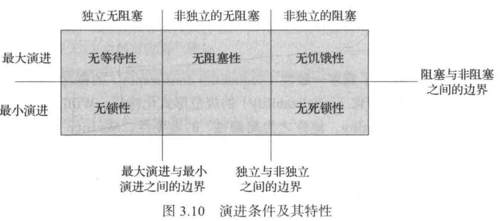

为并发对象的实现选择相应的演进条件不仅取决于应用程序的需要，同时还取决于底层平台的特性。无等待性和无锁性具有强大的理论支撑特性，它们几乎可以在任何平台上工作，并且能够为音乐、电子游戏以及其他交互式应用程序等实时应用程序提供有力的保证。 非独立的无阻塞性、无死锁性和无饥饿性等特性依赖于底层平台提供的保证。然而，只要有了底层平台的保证，非独立特性的实现通常就更简单、更有效。

## 9. 评析

对于应用程序而言，应该选择哪种正确性条件呢？这取决于应用程序的需求。负载较轻的打印服务器可能会满足于使用静态一致的作业队列，因为文档打印的先后次序是无关紧要的。而银行服务器则必须按照程序的次序来执行顾客的请求（例如，从储蓄账户中将 100 美元取出并转存到支票账户中，然后开具一张 50 美元的支票）， 所以需要使用顺序一致的队列。股票交易服务器则必须公平，以确保不同客户的订单按照到达的先后次序执行，这意味着需要使用一个可线性化的队列。

应用程序需要选择哪种演进条件呢？同样, 这也取决于应用程序的需求。在某种程度上，这是一个技巧性的问题。因为不同的方法，甚至是针对同一个对象的不同方法，都有可能需要使用不同的演进条件。例如，防火墙程序的表格查阅方法用于检查数据包的源地址是否可疑，它会经常被调用并且要求及时处理，因此可能希望该方法是无等待的。相比之下， 更新表格条目的方法却很少被调用，因此可以使用互斥来实现。后文我们将发现，在编写应用程序时，常常会自然而然地采用不同的演进保证来实现不同的方法。

那么对于一个特定的操作，应该选择哪一种演进条件呢？程序员通常希望所执行的任何操作最终都能完成，也就是说，程序员希望实现最大的演进。然而，确保最大的演进需要对底层平台进行假设（wait-free 不需要）。例如，操作系统如何调度线程的执行？演进条件的选择反映了程序员为了保证一个操作完成所做的假设。

对于任何演进保证，程序员必须假设执行操作的线程最终会被调度。对于某些关键操作，程序员可能不愿意做出进一步的假设，从而导致额外的开销以确保演进。对于其他操作，可以接受更强的假设，例如公平性或者用于调度的特定优先级方案，从而实现成本更低的解决方案。

> *如果执行操作的线程最终都不被调度，那无论什么演进条件都无法保证系统取得进展。*

对于程序设计人员而言，最理想的情形可能就是拥有可线性化的硬件、可线性化的数据结构以及良好的性能。令人遗憾的是，技术总是不完善的，就目前而言，性能良好的硬件通常甚至都不是顺序一致性的。具有良好的性能并且具有可线性化的数据结构，其实现的可能性是不得而知的。毫无疑问，为了让这个幻想成为现实还面临着许多挑战，本书的其余章节将介绍实现这一目标的路线图。
