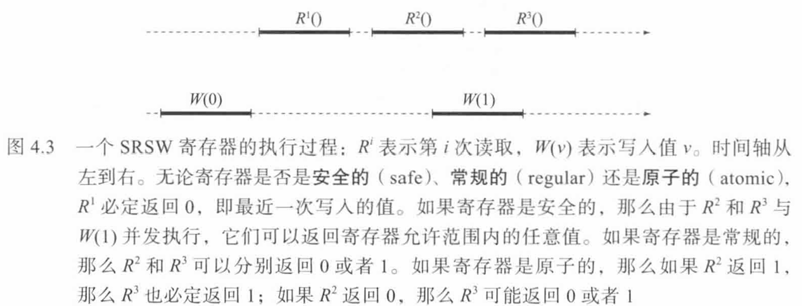
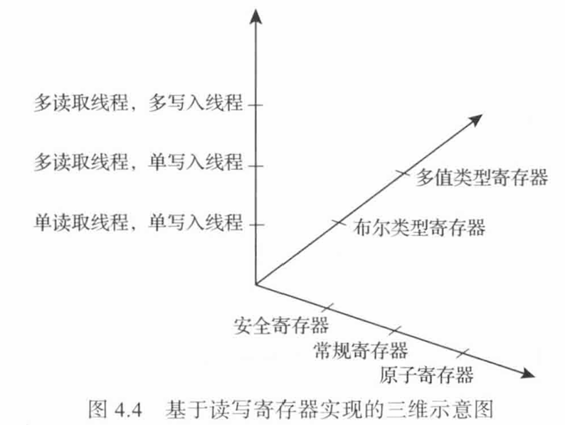
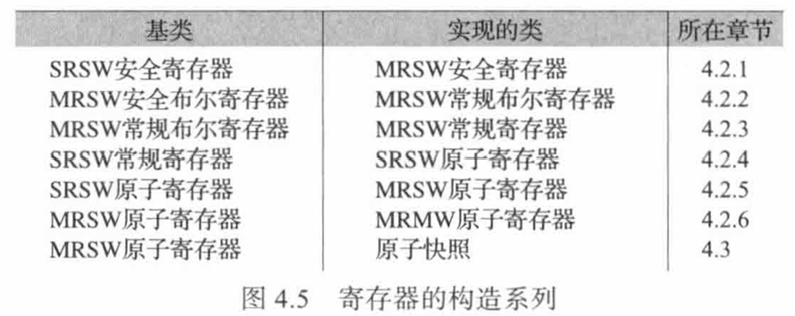
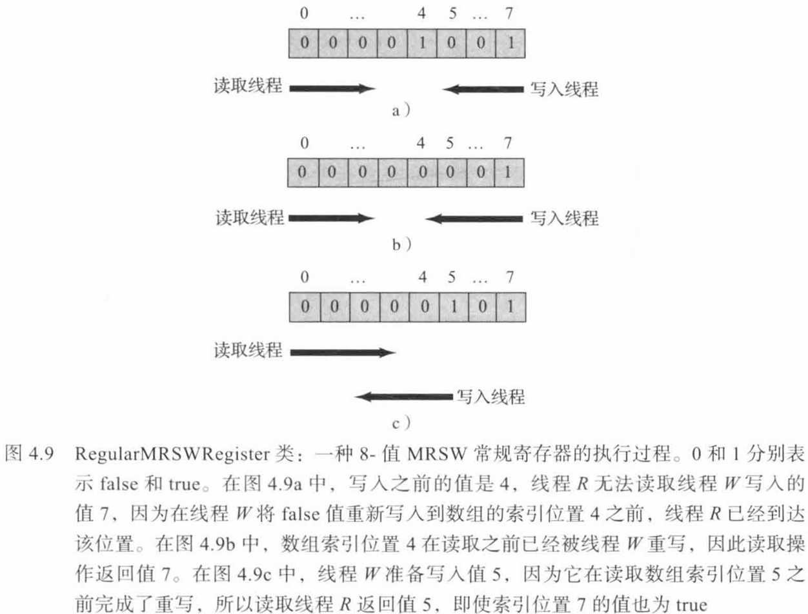
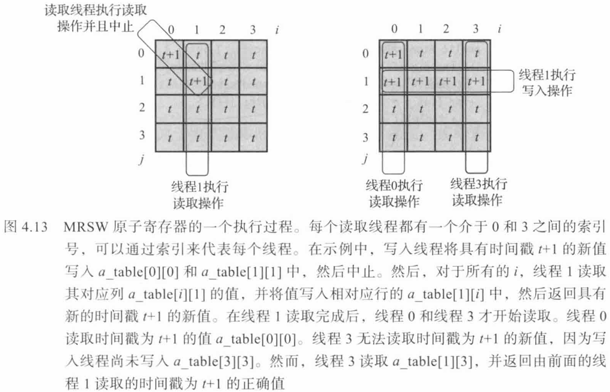
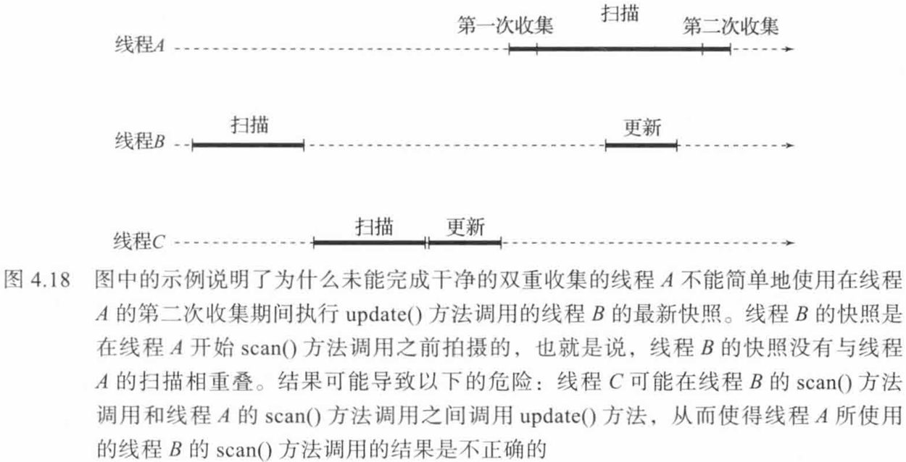
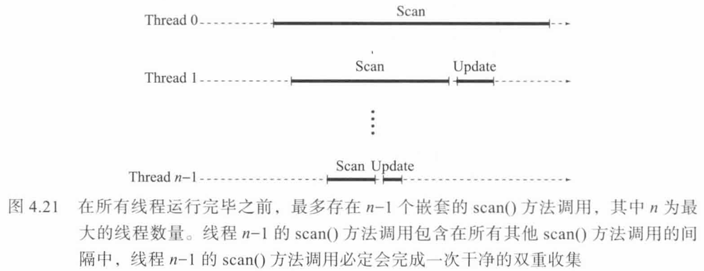

+++
title = "《多处理器编程的艺术》 第四章 共享存储器基础"
date = "2026-07-30"
tags = ["multiprocessor-programming", "concurrency", "register", "atomic", "snapshot", "wait-free", "nonblocking", "srsw", "mrsw", "mrmw"]

+++

<h1 align="center">多处理器编程的艺术</h1>
<h2 align="center">第四章 共享存储器基础</h2>

在本章中，我们开始研究并发**共享存储器计算**（concurrentshared memory computation） 的基本理论。读者学习这些算法时，可能会质疑它们的“现实价值”。如果你产生了质疑， 请记住它们的价值在于训练读者的直觉，能告诉你哪些类型的算法和方法在并发共享存储环 境中有效，哪些类型的算法和方法无效，虽然有时很难做出判断，但无论如何，这都将有助于我们尽早放弃无效的算法，从而节省时间和金钱。

串行计算的基础是由 Alan Turing 和 Alonzo Church 在 20 世纪 30 年代奠定的，他们各自独立地提出了**丘奇-图灵理论**（Church-Turingthesis）：任何可以计算的事情，都可以通过图灵机（或者等价地，通过丘奇的 lambda 演算子）进行计算。任何由图灵机无法求解的问题（例如，判断一个程序对于一个任意的输入是否会停机），普遍认为在任何一种实际计算设备上也都无法求解。丘奇-图灵理论只是一个理论，而不是一个定理，因为“什么是可计 算的”这个概念无法用精确的、数学上严格的方式来定义。尽管如此，几乎所有的人都认同丘奇-图灵理论。

为了研究并发共享存储器的计算，我们从它的计算模型开始。一个共享存储器的计算由多个**线程**组成，每个线程本身是一个串行的程序。这些线程之间通过调用驻留在共享存储器中的对象所提供的方法进行通信。线程是**异步**的（asynchronous），这意味着它们可能以不同的速度运行，并且任何线程都可能在任何时候停止，停止所持续的时间间隔也不可预知。这种异步概念反映了现代多处理器体系结构的实际情况，在这种体系结构中，线程延迟是不可预测的，从微秒（缓存未命中）级别到毫秒（页面错误）级别到秒（调度中断） 级别。

串行可计算性经典理论的发展可以分为多个阶段。最初的阶段是有限状态自动机，接下来的阶段是下推自动机，最后以图灵机达到顶峰。本书也同样分阶段研究并发的计算模型。本章研究的是最简单的共享存储器计算模型：并发线程仅通过读取和写入共享存储单元（即**寄存器**）进行通信。我们从简单的寄存器开始阐述，并进一步说明如何使用这些简单的寄存器来构造一系列更为复杂的寄存器。

大多数串行可计算性的经典理论并不考虑效率因素：为了证明一个问题是可计算的，只需要证明它可以用图灵机来求解就足够了。很少有人去考虑如何提高图灵机的效率，因为图灵机并不是一种实际的计算模型。同样，我们不大会尝试提高寄存器构造的效率，而是着重于理解这些结构是否存在以及这些结构的工作原理。这些理论计算模型并不会用作实际的计算模型。本章侧重于讨论容易理解但是效率不高的寄存器结构，而对于那些效率较高但却结构复杂的寄存器结构将不予考虑。

特别是在某些构造方法中，我们使用**时间戳**（即计数器值）来区分旧值和新值。时间戳的问题在于其增长不受限制，因而对于固定大小的变量最终会溢出。有界的解决方案（例如 2.8 节中的例子）也许更具说服力，因此我们鼓励读者通过阅读本章的章节注释中所提供的参考文献进行深人研究。然而，本章将重点讨论更简单的、无界的构造方式，这样可以更好地阐述并发程序设计的基本原理，从而避免读者的注意力被技术细节所分散。

## 1. 寄存器空间

在硬件层，线程通过读取和写入共享存储器进行通信。理解线程之间通信的一种好方法是对硬件原语进行抽象，并将通信看作是通过读取和写入**共享并发对象**（shared concurrent object）来实现的。第 3 章详细地描述了共享对象。现在，只需要回顾一下共享对象设计的两个关键特性：安全特性和活跃特性。安全特性由一致性条件来定义，而活跃特性则由演进条件来定义。

```java
public interface Register<T> {
    T read();
    void write(T v);
}
```

<p align="center">图4.1 寄存器 Register(T) 接口</p>

**读取 - 写入寄存器**（read-write register，或者简称**寄存器** register）是一个对象，它封装 了一个值，通过 read() 方法可以读取该值，也可以通过 write() 方法修改该值，这些方法通常被称为**加载**（load）和**存储**（store）。图 4.1 显示了由所有寄存器实现的 Register\<T\> 接口。 值的类型 T 通常是布尔值、整数或者对另一个对象的引用。实现 Register\<布尔类型\> 接口的寄存器称为**布尔**（boolean）寄存器（有时使用 1 和 0 来表示 true 和 false）。实现 Register<整数类型> 接口并且取值范围为 M 个整数的寄存器称为 **M - 值寄存器**（M-valued register）。本章不再具体讨论其他类型的寄存器，但是我们必须意识到，在具体实现中可以将整数类型替换为对象引用，因为任何实现整数类型寄存器的算法都可以适用于其他对象引用类型的寄存器（通过将引用表示为整数）。

```java
public class SequentialRegister<T> implements Register<T> {
    private T value;
    public T read() {
        return value;
    }
    public void write(T v) {
        value = v;
    }
}
```

<p align="center">图4.2 串行寄存器 SequentialRegister 类</p>

如果方法调用之间不重叠，那么寄存器实现的行为应该如图 4.2 所示。然而，在多处理器中，方法调用在任何时候可能都是重叠的，因此需要规范化地说明并发方法调用的具体含义。

图 4.2 所示串行寄存器类的一种可线性化实现是**原子寄存器**（atomic register）。不正式地说，一个原子寄存器的行为与我们预期的完全一致：每次读取操作都返回“上次”写入的值。从直观来看，线程通过读取和写入原子寄存器进行通信的模型非常有效，而且该模型在很长一段时间内一直作为并发计算的标准模型。

实现原子寄存器的一种方法是依赖于互斥：每一次调用 read() 方法或者 write() 方法时，通过获得互斥锁来保护寄存器：然而遗憾的是，在多处理器系统结构中，我们不能使用第 2 章阐述的锁算法：这些锁算法使用寄存器实现互斥，因此再使用互斥来实现寄存器显然并没 有太大的意义。而且，正如第 3 章所述，使用互斥方法，即使其实现是无死锁的或者无饥饿的，计算的演进仍然将取决于操作系统的调度程序，需要通过调度程序来确保线程永远不会在临界区内阻塞。因为我们的目标是讨论如何使用共享对象来研究并发计算的基本构成要素（寄存器），所以假设存在一个单独的实体来提供关键的演进特性是没有意义的。

下面介绍另外一种不同的方法。回顾前文简述的内容，如果对象的每个方法调用都能在有限的步骤内完成，并且每个方法的调用执行与其他并发方法的交错调用执行无关，则称这个对象的实现是**无等待**的，虽然无等待性条件看似简单并且自然，但却有着深远的影响。特别是，无等待性条件排除了任何类型的互斥，并且能够保证独立的演进，也就是说，这种方式不依赖于操作系统的调度程序。因此，通常要求寄存器的实现是无等待的。

另外，还必须明确指定所期望读取的线程和写入的线程的数量。很显然，实现支持单一读取线程和写入线程的读写器比实现支持多个读取线程和写入线程的寄存器更加容易。为了简洁起见，我们使用 SRSW 表示“单读取线程，单写入线程”，MRSW 表示“多读取线程，单写入线程”，MRMW 表示“多读取线程，多写入线程”。

在本章中，我们讨论以下基本问题：

**使用功能最强大的寄存器实现的数据结构，是否也可以使用功能最弱的寄存器来实现？**

回顾第1章所讲述的内容，线程之间的有效通信方式必定是持续的：发送的消息所持续的时间必须比发送方主动参与的时间更长。这种持续同步的最弱形式是（尚待论证）能够在共享存储器中设置一个持续位，而同步的最弱形式（毋庸置疑）是什么都没有。如果设置一个位的行为与读取这个位的行为不重叠，那么读取的值与写人的值是一致的。否则，读取与写入的行为存在重叠时读取可以返回任意值。

不同类型的寄存器能够提供不同的保障，因而使得寄存器的功能有强弱之别。例如，如前所述，不同寄存器封装的值的范围（例如，布尔值，或者值）以及支持的读取线程和写人线程的数量上有所差异。不同的寄存器所提供的一致性也可能不同。

如果满足以下条件，则SRSW或者MRSW寄存器的实现是安全的（safe）：

* 如果 read() 方法调用与 write() 方法调用不重叠，那么 read() 方法调用返回最近一次 write() 方法调用写入的值。
* 如果 read() 方法调用与 write() 方法调用相互重叠，那么 read() 方法调用可以返回寄存器允许的值范围内的任意值（对于一个 M - 值寄存器，将返回 0 到 中的 M-1 任意值）。

>*"最近一次 write() 方法调用" 没有任何歧义，因为只有一个写入线程。*

注意，“安全”一词是历史的偶然。因为它们提供的保证其实很弱，“安全”寄存器实际上非常不安全。

考虑图 4.3 所示的历史记录。如果寄存器是安全的，那么三次read 该如下所示：

* R^1^ 返回最近一次写入的值 0.
* R^2^ 和 R^3^ 与 W(1) 并发执行，因此它们可能返回寄存器范围内的任意值。



有必要定义一种介于安全寄存器和原子寄存器之间的一致性。**常规** (regular) 寄存器是一种 SRSW 或者 MRSW 寄存器，其中写入操作不会以原子方式进行。相反，当 write() 方法调用正在执行时，在新值还没有最终替换旧值之前，正在读取的值可能会在新值和旧值之间 “闪动”。更准确地说:

* 常规寄存器是安全的，因此任何一个 read() 方法调用，如果与 write() 方法调用不重叠，则 read() 方法调用都会返回最近写入的值。
* 假设一个 read() 方法调用与一个或者多个 write() 方法调用重叠。令 v^0^ 为最后一次 write() 方法调用写入的值，v^1^，……，v^k^ 是与 read() 方法调用相重叠的 write() 方法调用所写入的值序列，那么 read() 方法调用可能会返回 v^i^，其中 i 为 0 到 k 之间的任意值。

对于图 4.3 中的执行过程，一个常规寄存器的执行行为如下：

* R^1^ 返回旧的值 0。
* R^2^ 和 R^3^ 分别返回旧的值 0 或者新的值 1。

常规寄存器是满足静态一致性的 (参见第3章)，但反之则不然。安全寄存器和常规寄存器都只允许有一个写入线程。

对于一个原子寄存器，图 4.3 中的执行过程可能会产生以下结果：

* R^1^ 返回旧的值0。
*  如果 R^2^ 返回1, 那么 R^3^  也返回1。
* 如果 R^2^ 返回 0, 那么 R^3^ 返回0或者1。

各种寄存器的三维示意图如图 4.4 所示：其中，第一个维度定义寄存器的类型；第二个维度定义读取线程和写入线程的数量；第三个维度定义寄存器的一致性特性。



千万不要完全按照字面意义来解读该示意图：其中有几种组合没有明确定义，例如多写入安全寄存器。

为了便于分析常规寄存器和原子寄存器的实现算法，可以直接根据对象的历史记录来重新进行定义。从现在起，我们只考虑每一个read() 方法调用返回由某个 write() 方法调用写入的值的历史记录（常规寄存器和原子寄存器不允许读取操作对返回值进行虚构）。为了简单起见，我们假设读取或者写入的值都是唯一的。

回顾前文所述内容，一个对象的历史记录是由**调用**事件和**响应**事件所构成的系列，当一 个线程调用方法时发生调用事件，当调用返回时发生与之相匹配的响应事件。**方法调用**（或者简称**调用**）是相匹配的调用事件和响应事件（包括调用事件和响应事件）之间的时间间隔。 对于任意一个历史记录，必定存在着一个关于方法调用的偏序关系 “—>”，其定义如下：对 于方法调用 m~0~ 和 m~1~，如果 m~0~ 的响应事件先于 m~1~ 的调用事件，那么 m~0~ —> m~1~。

任意一个寄存器的实现（无论是安全的、常规的还是原子的），都可以在 write() 方法调用上定义一个全序关系，称为**写入次序**（write order），用以表示在寄存器中写入操作“生效” 的次序。对于安全寄存器和常规寄存器，写入次序并不重要，因为它们一次只允许一个写入线程。对于原子寄存器，所有的方法调用具有一个可线性化的次序。我们使用这个次序来对写人调用进行索引排序：写入调用 W^0^ 的次序是第一个，W^1^ 的次序是第二个，依此类推。我 们使用 v^i^ 来表示 W^i^ 写入的唯一值。请注意，对于 SRSW 或者 MRSW 安全寄存器或者常规寄存器而言，写入次序与数据写入的顺序完全相同。

使用 R^i^ 来表示任意一个返回 v^i^ 的 read() 方法调用。注意，尽管一个历史记录中最多包含一个 W^i^ 调用，但它可能包含多个 R^i^ 调用。

可以证明以下条件能够准确地描述什么是一个常规寄存器。首先，read() 方法调用不会返回将来的值：绝不可能存在 R^i^ —> W^i^（4.1.1）。

其次，read() 方法调用不会返回更远的过去值 (先于最近一次写入的并且不重叠的值)：对于某个值 j，绝不可能存在 W^i^ —> W^j^ —> R^i^（4.1.2）。

为了证明一个寄存器的实现是常规的，必须证明该寄存器的历史记录满足条件（4.1.1） 和条件（4.1.2）。

一个原子寄存器还要满足另一个附加条件：如果 R^i^ —> R^j^，那么 i <= j（4.1.3）。

这个条件表明，一个较早的读取操作的返回值不能晚于一个较晚的读取操作所返回的值。常规寄存器不需要满足条件（4.1.3）。为了证明寄存器的实现是原子的，我们首先需要定义一个写入次序，然后证明其历史记录满足条件（4.1.1）〜（4.1.3）。

> *简单理解：*
>
> - *安全寄存器：最弱。读操作只有在没有并发写操作时，才返回上次不重叠写操作的值；如果读写并发，可以返回取值范围内的任意值。*
> - *常规寄存器：中等。满足安全寄存器的条件，并且读操作在存在并发写操作时，不能返回任意值，必须返回重叠写操作的值或上次不重叠写操作的值（二选一）。*
> - *原子寄存器：最强。读操作返回该线性一致性排序中最近一次写入的值。*

## 2. 寄存器构造

下面我们将讨论如何利用简单的安全的布尔型 SRSW 寄存器来实现一系列功能强大的寄存器。我们将讨论一系列寄存器构造（如图 4.5 所示），通过功能较弱的寄存器来构造功能强大的寄存器。这些构造意味着所有的读取和写入寄存器类型都是等价的，至少在可计算性方面是如此。



在本章的最后，我们将讨论如何使用原子寄存器（以及安全寄存器）来实现一个**原子快照**（atomic snapshot）。原子快照由不同线程写入 MRSW 寄存器数组，然后任何线程以原子方式读取它。

上述表格中的一些构造比实现派生序列所需的功能更为强大（例如，实现 SRSW 原子寄存器的派生类，并不需要为常规寄存器和安全寄存器提供多线程读取特性）。我们之所以罗列这些寄存器，其目的在于这些构造提供了有价值的见解。

> *派生序列是指通过一系列构造算法，从较弱的寄存器类型逐步推导出较强寄存器类型的演进链条。*

本书的代码示例遵循以下约定。在描述特定类型寄存器的算法时（例如，一个 MRSW 安全布尔寄存器时，我们使用如下形式来表示该算法：

```java
class SafeBooleanMRSWRegister implements Register<Boolean> {
    ...
}
```

虽然上述表示方法能够清楚地说明所要实现的 Register<> 类的属性，但是如果使用这个类来实现其他类时会变得十分烦琐。因此，在描述类的实现时，我们使用以下约定来表示特定字段是否为安全的、常规的或者是原子的。以一个名为 mumble 的字段为例，如果它是安 全的，则命名为 s_mumble；如果它是常规的，则命名为 r_mumble；如果它是原子的，则命名为 a_mumble。有关某个字段其他方面的特性（例如，字段的类型，以及它是否支持多个读取线程或者多个写入线程），则在代码中使用注释方式加以说明，并且在上下文中其语义也应该清楚无误。

### 2.1 MRSW 安全寄存器

图 4.6 描述了如何使用一种 SRSW 安全寄存器构造一种 MRSW 安全寄存器。

```java
public class SafeBooleanMRSWRegister implements Register<Boolean> {
    boolean[] s_table;	// SRSW 安全布尔寄存器数组
    public SafeBooleanMRSWRegister(int capacity) {
        s_table = new boolean[capacity];
    }
    public Boolean read() {
        return s_table[ThreadID.get()];
    }
    public void write(Boolean x) {
        for (int i = 0; i < s_table.length; i++)
            s_table[i] = x;
    }
}
```

<p align="center">图4.6 SafeBooleanMRSWRegister 类：一种 MRSW 安全布尔寄存器</p>

**引理4.2.1**  图 4.6 中的构造是一种 MRSW 安全寄存器。

**证明**  如果线程 A 的 read() 方法调用不与任何一个 write() 方法调用重叠，那么该 read() 方法的调用不与 SRSW 寄存器 s_table[A] 的任何一个 write() 方法调用重叠，因此 read() 方法的调用返回 s_table[A] 最近一次写人的值。如果线程 A 的 read() 方法调用与一个 write() 方法调用重叠，则 SRSW 寄存器 s_table[A] 可以返回任意值。证毕。

> *如果 read 与 write 不重叠，假设上一次 write 写入的值为 true，SRSW 安全布尔寄存器保证 read s_table[ThreadID.get()] 为 true，最终返回 true，因此 read 返回最近一次写入的值。*
>
> *如果 read 与 write 重叠，假设上一次 write 写入的值为 true，重叠的 write 写入的值为 true / false，SRSW 安全布尔寄存器保证 read s_table[ThreadID.get()] 为 true 或 false，最终返回取值范围内的任意值。*
>
> *综上所述，在任意情况下图 4.6 的构造都满足 MRSW 安全布尔寄存器的条件。*

### 2.2 MRSW 常规布尔寄存器

图 4.7 描述了加何使用一种 MRSW 安全布尔寄存器构造一种 MRSW 常规布尔寄存器。对于布尔寄存器而言，只有当要写入的新值 x 与旧值相同时，安全布尔寄存器和常规布尔寄存器之间才会有所区别，常规寄存器只能返回 x，而安全寄存器可以返回任意一个布尔值。因此，只需确保写入的新值与以前写入的值不相同时才允许修改值，这样就可以解决这个问题了。

```java
public class RegularBooleanMRSWRegister implements Register<Boolean> {
    ThreadLocal<Boolean> last;
    boolean s_value;	// MRSW 安全布尔寄存器
    RegularBooleanMRSWRegister(int capacity) {
        last = new ThreadLocal<Boolean>() {
            protected Boolean initialValue() { return false; };
        };
    }
    public void write(Boolean x) {
        if (x != last.get()) {
            last.set(x);
            s_value = x;
        }
    }
    public Boolean read() {
        return s_value;
    }
}
```

<p align="center">图4.7 RegularBooleanMRSWRegister 类：一种使用MRSW 安全布尔寄存器构造的MRSW 常规布尔寄存器</p>

**引理4.2.2**  图 4.7 中的构造是一种 MRSW 常规布尔寄存器。

**证明**  如果一个 read() 方法调用不与任何一个 write() 方法调用相重叠，则返回最近一次写入的值。如果两个调用之间存在着重叠，则需要考虑以下两种情况：

* 如果需要写入的值与最后一次写入的值相同，那么写入线程将不写入安全寄存器，这时只能读到上次写入的值，相当于只能读到上次写入的值或这次并发写入的值，符合常规布尔寄存器的条件。
* 如果需要写入的值与最后一次写入的值不相同，一个并发的读取线程将返回 MRSW 安全寄存器取值范围内的任意值，要么是 true 要么是 false，这两种情况都符合常规布尔寄存器的条件。 

证毕。

> *如果 read 与 write 不重叠，假设上一次 write 写入的值为 true，那么 MRSW 安全布尔寄存器保证 read s_value 为 true，最终返回 true，因此 read 返回最近一次写入的值。*
>
> *如果 read 与 write 重叠，假设上一次 write 写入的值为 true：*
>
> * *假设重叠的 write 写入的值为 true，那么这个 write 不会执行，MRSW 安全布尔寄存器保证 read s_value 为 true，最终返回 true。*
> * *假设重叠的 write 写入的值为 false，MRSW 安全寄存器保证 read s_value 为 true 或 false，最终返回 true 或 false。*
>
> *综上所述，在任意情况下图 4.7 的构造都满足 MRSW 常规布尔寄存器的条件。*

### 2.3 MRSW 常规 M - 值寄存器

如果使用一元符表示值的方法，可以很容易地使用布尔寄存器实现 M- 值寄存器，尽管这种实现方式的效率会低得惊人。在图 4.8 中，我们将 M - 值寄存器实现为 M个常规布尔寄存器的数组。寄存器的初始值为 0，通过将数组的第 0 位设置为 true 来表示。如果一个写入方法需要写入值 x，则在数组的第 x 个索引位置处中写入 true, 然后按照数组索引的降序次序将所有较低的位置设置为 false。读取方法则按照索引的升序次序读取数组单元的值，直到第一次读到某个索引位置 i 中的值为 true 为止，然后返回 i。图 4.9 中的示例描述了一个 8 - 值寄存器。

```java
public class RegularMRSWRegister implements Register<Byte> {
    private static int RANGE = Byte.MAX_VALUE - Byte.MIN_VALUE + 1;
    boolean[] r_bit = new boolean[RANGE];	// MRSW 常规布尔寄存器数组
    public RegularMRSWRegister(int capacity) {
        for (int i = 1; i < r_bit.length; i++) {
            r_bit[i] = false;
        }
        r_bit[0] = true;
    }
    public void write(Byte x) {
        r_bit[x] = true;
        for (int i = x - 1; i >= 0; i--) {
            r_bit[i] = false;
        }
    }
    public Byte read() {
        for (int i = 0; i < RANGE; i++) {
            if r_bit[i] {
                return i;
            }
        }
        return  -1;	//读取失败
    }
}
```

<p align="center">图4.8 RegularMRSWRegister 类：一种 MRSW 常规 M - 值寄存器</p>

**引理4.2.3**  在图 4.8 所示的构造中，read() 方法调用总是返回一个值，该值对应于 0 到 M-1 之间由某个 write() 方法调用所设置的一个位。

**证明**  以下特性是不变的：如果一个读取线程正在读取 r_bit[j]，则必定有某个索引号大于或者等于 j 的位被一个 write() 方法调用设置为 true。

当寄存器初始化时，并没有读写线程，构造函数将 r_bit[0] 设置为 true。假设一个读取线程正在读取 r_bit[j]，并且 r_bit[k] 为 true（k >= j）。那么：

* 如果读取线程从 j 前进到 j+1, 那么 r_bit[j] 为 false，因此 k > j（即，一个大于或者等于 j+1 的位的值为 true）。

* 仅当写入线程将更高的位 r_bit[L]（L>k）设置为 true 时，才会清除 r_bit[k] 的值。

证毕。



**引理4.2.4**  图 4.8 中的构造是一种 MRSW 常规 M- 值寄存器。

**证明**   对于任意一个读取操作，令 x 是由最近一次与之不相重叠的 write() 方法所写人的值。在 write() 方法调用完成时，a_bit[x] 被设置为 true，并且对于所有的 i < x，a_bit[i] 都为 false。根据引理 4.2.3 可知，如果读取线程返回的值不是 x，那么它必定观察到某个 a_bit[j] (j != x) 为 true，并且该位必定由某个并发的写入操作所设置，从而证明了满足条件 (4.1.1）和条件 (4.1.2)。

证毕。

> *如果 read 与 write 不重叠，假设上一次 write 写入的值为 x，那么 MRSW 常规布尔寄存器可以保证 read r_bit[i < x] 为 false，read r_bit[x] 为 true，最终返回 x，因此 read 会读取到最近一次写入的值。*
>
> *如果 read 与 write 重叠，假设上一次 write 写入的值为 x，重叠的 write 写入的值为 y：*
>
> * *如果 y < x：那么 MRSW 常规布尔寄存器可以保证 read r_bit[i < y] 为 false，read r_bit[y] 为 true 或 false，如果为 true 则最终返回 y；如果为 false 则 MRSW 常规布尔寄存器可以保证 read r_bit[y < i < x] 为 false，read r_bit[x] 为 true，最终返回 x。*
> * *如果 y = x：那么 MRSW 常规布尔寄存器可以保证 read r_bit[i < y] 为 false，read r_bit[y] 为 true，最终返回 y = x。*
> * *如果 y > x：那么 MRSW 常规布尔寄存器可以保证 read r_bit[i < x] 为 false，read r_bit[x] 为 true，最终返回 x。*
>
> *综上所述，在任意情况下图 4.8 的构造都满足 MRSW 常规 M - 值寄存器的条件。*

### 2.4 SRSW 原子寄存器

本节将讨论如何使用 SRSW 常规寄存器来构造 SRSW 原子寄存器（请注意，我们的构造使用无界时间戳）。

常规寄存器满足条件（4.1.1）和条件（4.1.2），而原子寄存器同时还必须满足条件 （4.1.3）。由于 SRSW 常规寄存器不支持并发读取操作，所以违背条件（4.1.3）的唯一情形是：对于两个读取线程，如果它们都与一个写入线程相重叠，并且这两个读取线程所读取的值的次序颠倒，第一个读取线程返回 v^i^ 而第二个读取线程返回 v^j^，其中 j < i。

```java
public class StampledValue<T> {
    public long stamp;
    public T value;
    // 初始值时间戳为 0
    public StampedValue(T init) {
        stamp = 0;
        value = init;
    }
    // 提供包含时间戳标签的值
    pulic StampedValue(long ts, T v) {
        stamp = ts;
        value = v;
    }
    public static StampedValue max(StampedValue x, StampedValue y) {
        if (x.stamp > y.stamp) {
            return x;
        } else {
            return y;
        }
    }
    public static StampedValue MIN_VALUE = new StampedValue(null);
}
```

<p align="center">图 4.10 StampedValue(T) 类：允许作为一个整体同时读取或者写入时间戳和值</p>

图 4.10 描述了一个封装值的类，其中每个值都有一个包含时间戳的附加标签。我们实现的 AtomicSRSWRegister（如图 4.11 所示）寄存器使用这些标签对写入调用进行排序，从而使得并发的读取调用可以按照正确的次序进行读取。每次读取调用都会记住其读取的最新 （最高时间戳）时间戳-值对，以便为后续读取所使用。如果一个较晚的读取操作读到一个较早的值（时间戳较低的值），则忽略该值并仅使用所记住的最新值。类似地，写人线程也会记住其写入的最新时间戳，并用一个更新的时间戳（例如，比前一个时间戳大 1）来标记 每个要写入的新值。

```java
public class AtomicSRSWRegister<T> implements Register<T> {
    ThreadLocal<long> lastStamp;
    ThreadLocal<StampedValue<T>> lastRead;
    StampedValue<T> r_value;	// SRSW 常规时间戳-值对寄存器
    public AtomicSRSWRegister(T init) {
        r_value = new StampedValue<T>(init);
        lastStamp = new ThreadLocal<long>() {
            protected Long initialValue() { return 0; };
        };
        lastRead = new ThreadLocal<StampedValue<T>>() {
            protected StampedValue<T> initialValue() { return r_value; };
        };
    }
    public T read() {
        StampedValue<T> value = r_value;
        StampedValue<T> last = lastRead.get();
        StampedValue<T> result = StampedValue.max(value, last);
        lastRead.set(result);
        return result.value;
    }
    public void write(T v) {
        long stamp = lastStamp.get() + 1;
        r_value = new StampedValue(stamp, v);
        lastStamp.set(stamp);
    }
}
```

<p align="center">图4.11 AtomicSRSWRegister 类：一种使用 SRSW 常规寄存器构造的 SRSW 原子寄存器</p>

该算法要求系统能够将一个值和一个时间戳作为独立的单元进行读取或者写入。在类似 C 这样的语言中，可以将值和时间戳一起视为无类型的位（“原始数据位”，并使用移位和逻辑屏蔽将两个值打包和解包到一个或者多个字中。在 Java 中，可以很容易创建一个用于保存时间戳或值对的 StampedValue＜T＞结构，并且在寄存器中存储对该结构的引用。

**引理4.2.5**  图 4.11 中的构造是一种 SRSW 原子寄存器。

**证明**  因为图 4.11 中的寄存器是常规的，因此满足条件（4.1.1）和条件（4.1.2）。同时，由于写入操作完全按照时间戳排序，如果一个读取操作返回一个给定的值，则较晚的读取操作将无法读取较早写入的值，因为较早写入的值具有较小的时间戳。所以，该算法满足条件（4.1.3）。证毕。

> *如果 read 与 write 不重叠，假设上一次 write 写入的值为 (x, t2)，SRSW 普通寄存器保证 read r_value 为 (x, t2)，上一次 read lastRead 为 (y, t1)，因为 write 写入的时间戳单调递增，因此 t2 >= t1，最终返回 (x, t1)，因此 read 会读取到最近一次写入的值。*
>
> *如果 read 与 write 重叠，假设上一次 write 写入的值为 (x, t2)，重叠的 write 写入的值为 (y, t3)：*
>
> * *假设上一次 read lastRead 为 (z, t1)，t1 < t2，SRSW 普通寄存器保证 read r_value 为 (x, t2) 或 (y, t3)，最终返回的时间戳大于 t1。*
> * *假设上一次 read lastRead 为 (x, t2)，t2 = t2，SRSW 普通寄存器保证 read r_value 为 (x, t2) 或 (y, t3)，最终返回的时间戳大于等于 t2。*
> * *假设上一次 read lastRead 为 (y, t3)，t3 > t2，SRSW 普通寄存器保证 read r_value 为 (x, t2) 或 (y, t3)，取 r_value 和 lastRead 两者时间戳较大的那个，最终返回的时间戳大于等于 t3。*
>
> *综上所述，在任意情况下图 4.11 的构造都满足 SRSW 原子寄存器的条件。*

### 2.5 MRSW 原子寄存器

为了理解如何使用 SRSW 原子寄存器构造 MRSW 原子寄存器，我们首先考虑一个简单的算法，该算法直接使用 4.2.1节中的构造，使用SRSW 安全寄存器构造 MRSW 安全寄存器。将数组 a_table[0..n-1] 的单元换成 SRSW 原子寄存器，并且所有其他的调用保持不变：写入线程按照索引号递增的次序写入数组位置，然后，每个读取线程读取并返回其关联的数组数据元素。

然而，其构造并不是一个多读取线程的原子寄存器。因为每个读取线程都从一个原子寄存器中读取数据，所以条件（4.1.3）对单读取线程成立；但是对多读取线程，该条件并不成立。

例如，考虑这样的一个写入操作，该操作首先设置 SRSW 寄存器的第一个数据元素 a_table[0]，但是在写入剩余位置 a_table[1..n-1] 之前被延迟。随后线程 0 读取并返回正确的新值，但是对于一个紧接着读取线程 0 之后的后续线程 1，会读取并返回较早的值，因为写入线程尚未更新 a_table[0..n-1]。对于这个问题，我们可以通过**让较早的读取线程将它们读取的值告知较晚的线程来解决**。

```java
public class AtomicMRSWRegister<T> implements Register<T> {
    ThreadLocal<Long> lastStamp;
    // 每个数据元素都是一个 SRSW 原子寄存器
    private StampedValue<T>[][] a_table;	
    public AtomicMRSWRegister(T init, int readers) {
        lastStamp = new ThreadLocal<Long>() {
            protected Long initialValue() { return 0; };
        };
        a_table = (StampedValue<T>[][]) new StampedValue[readers][readers];
        StampedValue<T> value = new StampedValue<T>(init);
        for (int i = 0; i < readers; i++) {
            for (int j = 0; j < readers; j++) {
                a_table[i][j] = value;
            }
        }
    }
    public T read() {
        int me = ThreadID.get();
        StampedValue<T> value = a_table[me][me];
        for (int i = 0; i < a_table.length; i++) {
            value = StampedValue.max(value， a_table[i][me]);
        }
        for (int i = 0; i < a_table.length; i++) {
            if (i == me) continue;
            a_table[me][i] = value;
        }
        return value;
    }
    public void write(T v) {
        long stamp = lastStamp.get() + 1;
        lastStamp.set(stamp);
        StampedValue<T> value = new StampedValue<T>(stamp, v);
        for (int i = 0; i < a_table.length; i++) {
            a_table[i][i] = value;
        }
    }
}
```

<p align="center">图 4.12 AtomicMRSWRegister 类：一种使用 SRSW 原子寄存器构造的 MRSW 原子寄存器</p>

具体的实现如图 4.12 所示。n 个线程共享一个具有时间戳标记的值所组成的 n × n 数组 a_table\[0..n-1][0..n-1]。正如 4.2.4 节所述，我们使用时间戳值以允许较早的读取线程告知较晚的读取线程，从而判断读取的哪个值是最新的。对角线上的位置上，即 a_table\[i][i]（对所有 i），对应于前面讨论的简单但是无效的寄存器构造。写入线程只需要使用新值和时间戳（随 write() 方法调用不断递增）一个接一个地写入到对角线位置上。

与前面的算法一样，读取线程 A 首先读取 a_table\[A][A]，然后它使用剩余的 SRSW 位置 a_table\[A][B]（A!=B）来完成读取线程 A 和读取线程 B 之间的通信。在读取 a_table\[A][A] 之后，每个读取线程 A 都会通过遍历其对应的列（所有的读取线程 B 所对应的 a_table\[B][A]）以检查其他读取线程是否读取了较后的值，并检查其是否包含一个较新的值（具有较高时间戳的值）。然后，读取线程 A 通过将该值写入其对应行中的所有位置（所有的读取线程 B 所对应的 a_table\[A][B]），从而让所有较晚的读取线程知道它读取的最新值。因此，在线程 A 的读取完成之后，随后线程 B 的每次读取都会看到线程 A 最后读取的值（因为它读取了 a_table\[A][B]）。图 4.13 给出该算法的一个执行示例。



**引理4.2.6**  图 4.12 中的构造是一种 MRSW 原子寄存器。

**证明 **  首先，任何读取线程都不会返回一个来自未来的值，因此很显然条件（4.1.1）成立。其次，由构造可知，write() 方法调用是严格按递增的次序写入时间戳的。理解该算法的关键是观察到任何行或者任何列上的最大时间戳也是严格递增的。如果线程 A 写入值的时间戳为 t，那么线程 B 的任何后续 read() 方法调用（这里线程 A 的调用完全先于线程 B 的调用）所读取的（从 a_table 表的对角线上）最大时间戳必定大于或等于 t，从而满足条件（4.1.2）。最后，如前所述，如果线程 A 的 read() 方法调用完全先于线程 B 的 read() 方法调用，那么线程 A 将把时间戳为 t 的值写入线程 B 的列中的其中一个单元，因此线程 B 将选择一个时间戳大于或者等于 t 的值，所以满足条件（4.1.3）。证毕。

从直观上看，违反原子性的反例是由两个不重叠的读取事件引起的，较早读取的值比那些较晚读取的值要旧。如果两个读取线程相重叠，那么可以任意重新排列它们的可线性化点。然而，由于这两个读取线程不重叠，它们的可线性化点的次序是固定的，因此不能满足原子性要求。这是我们在设计算法时应该寻找反例类型（顺便说一句，我们在单读取线程原子寄存器构造中也使用了相同的反例）。

我们的解决方案使用了两种算法工具：**时间戳**（在后续章节的许多实际算法中被使用）和**间接帮助**（一个线程告诉其他线程它所读取的内容）。通过这两种方式，如果一个写入线程在只向一部分读取线程传递信息后中止，那么这些读取线程之间可以通过传递信息来进行协作。

>*如果 read 与 write 不重叠，假设上一次 write 写入的值为 (x, t)，SRSW 原子寄存器保证 read a_table\[me][me] 为 (x, t)，read a_table\[i != me][me] 为 (xi, ti)，因为 write 写入的时间戳单调递增，因此 ti <= t，最终返回的值为 (x, t)。并且上一次 read 读取的值的时间戳只可能小于等于 t，因此 read 会读取到最近一次写入的值并且不早于上一次 read。*
>
>*如果 read 与 write 重叠，假设上一次 write 写入的值为 (x, t1)，重叠的 write 写入的值为 (y, t2)，write 在写入 a_table\[1][1] 后，线程 1 和 线程  2 开始 read：*
>
>* *如果线程 2 先于线程 1 read，SRSW 原子寄存器保证 read a_table\[i][2] 为 (x, t1)，因此线程 2 读到 (x, t1)；SRSW 原子寄存器保证 read a_table\[i != 1][1] 为 (x, t1)，read a_table\[1][1] 为 (y, t2)，因为 t2 > t1，因此线程 1 读到 (y, t2)，线程 1 读到的值晚于线程 2。*
>* *如果线程 1 先于线程 2 read，SRSW 原子寄存器保证 read a_table\[i != 1][1] 为 (x, t1)，read a_table\[1][1] 为 (y, t2)，因为 t2 > t1，因此线程 1 读到 (y, t2)，线程 1 会 write a_table\[1][2] 为 (y, t2)；SRSW 原子寄存器保证 read a_table\[i != 1][2] 为 (x, t1)，read a_table\[1][2] 为 (y, t2)，t2 > t1，因此线程 2 读到 (y, t2)，线程 2 读到的值不早于线程 1。*
>
>*综上所述，在任意情况下图 4.12 的构造都满足 MRSW 原子寄存器的条件。*

### 2.6 MRMW 原子寄存器

接下来讨论如何使用一个 MRSW 原子寄存器数组（每个元素对应一个线程）构造一个 MRMW 原子寄存器。

当线程 A 需要写入寄存器时，线程 A 首先读取所有的数组元素，选择一个比线程观察到的任何时间戳都要大的时间戳，并将一个标记该时间戳的值写入数组元素 A。当一个线程需要读取寄存器时，该线程首先读取所有的数组元素，然后返回其中具有最大时间戳的元素值。这与 2.7 节中讨论的面包房锁算法所使用的时间戳算法完全相同。与面包房锁算法中一致，我们使用（时间戳，线程 ID 值）的字典次序。

```java
public class AtomicMRMWRegister<T> implements Register<T> {
    private StampedValue<T>[] a_table;	// MRSW 原子寄存器数组
    public AtomicMRMWRegister(int capacity, T init) {
        a_table = (StampedValue<T>[]) new StampedValue[capacity];
        StampedValue<T> value = new StampedValue<T>(init);
        for (int j = 0; j < a_table.length; j++) {
            a_table[j] = value;
        }
    }
    public void write(T value) {
        int me = ThreadID.get();
        StampedValue<T> max = StampedValue.MIN_VALUE;
        for (int i = 0; i < a_table.length; i++) {
            max = StampedValue.max(max, a_table[i]);
        }
        a_table[me] = new StampedValue(max.stamp + 1, value);
    }
    public T read() {
        StampedValue<T> max = StampedValue.MIN_VALUE;
        for (int i = 0; i < a_table.length; i++) {
            max = StampedValue.max(max, a_table[i]);
        }
        return max.value;
    }
}
```

<p align="center">图 4.14 MRMW 原子寄存器</p>

**引理4.2.7**  图 4.14 中的构造是一种 MRMW 原子寄存器。

**证明**  按照 write() 方法调用的时间戳和线程ID的字典次序，对所有的write()方法调用进行排序，是的在 t~A~ < t~B~ 或者 t~A~ = t~B~ 时，并且 A < B 的情况下，则线程 A（时间戳为 t~A~）的 write() 方法调用先于线程 B（时间戳为 t~B~）的 write() 方法调用。这种字典序与 "—>" 是相一致的，有关证明留作练习题。。如前文所述，我们按写入的次序把每个write()方法调用排 列成 W^0^，W^1^，……。

很明显，当一个 read() 方法调用完成后，它不能读取 a_table[] 中写入的值，并且任意 一个完全在该 read() 方法调用之后的 write() 方法调用，其时间戳都要大于读取完成前的任何 write() 方法调用的时间戳，这意味着满足条件（4.1.1）。

考虑条件（4.1.2）, 该条件不允许跳过先前最近的write()方法调用。假设线程 A 的一个 write() 方法调用先于线程 B 的一个 write() 方法调用，而线程 B 的一个 write() 方法调用 又先于线程 C 的一个 read() 方法调用。如果 A=B, 那么较晚的 write() 方法调用会覆盖 a_table[A]，并且 read() 方法调用不会返回较早写入的值。如果 A!=B，那么由于线程 A 的时间戳小于线程 B 的时间戳，任何观察到两个操作的线程 C 会返回线程B的值（或者时间戳更高的值），所有构造满足条件（4.1.2）。

最后，考虑条件（4.1.3）, 该条件不允许读取次序违背写入次序。假设线程 A 的所有 read() 方法调用都完全先于线程 B 的某个 read() 方法调用，并且在写入次序上线程C的所有 write() 方法调用都先于线程 D 的 write() 方法调用。我们需要证明，如果线程 A 返回线程 D 的值，那么线程B就不会返回线程 C 的值。如果 t~C~<t~D~，那么当线程 A 从 a_table[D] 中读取时间戳 t~D~，线程 B 从 a_table[D] 中读取到大于或者等于 t~D~ 的时间戳，并且不会返回与时间戳 t~C~ 相关联的值。如果 t~C~=t~D~，即写人操作是并发的，那么按照写入顺序有 C<D，因此如果线程 A 从 a_table[D] 中读取到时间戳 t~D~，那么线程 B 也会从 a_table[D] 中读取时间戳 t~D~，并且返回与时间戳 t~D~（或者更高）相关联的值，即使它从 a_table[C] 中读取到 t~C~ 也是如此。 证毕。

>*如果 read 与 write 不重叠，假设上一次 write 写入的值为 (x, t)，上一次 read 读取的值的时间戳只可能小于等于 t，MRSW 原子寄存器保证 read a_table\[me] 为 (x, t)，最终返回的值为 (x, t)，因此 read 会读取到最近一次写入的值并且不早于上一次 read。*
>
>*如果 read 与 write 重叠，假设上一次 write 写入的值为 (x, t1)，重叠的 write 写入的值为 (y, t2)，无论上一次 read 读取的值是 (x, t1) 或者 (y, t2)，MRSW 原子寄存器保证 read 读取的值的时间戳一定大于等于上一次 read 的值。*
>
>*综上所述，在任意情况下图 4.14 的构造都满足 MRMW 原子寄存器的条件。*

前文讨论的一系列寄存器构造表明，可以使用 SRSW 安全布尔寄存器构造出一个无等待的 MRMW 原子值寄存器。当然，没有人愿意使用安全寄存器来编写并发算法，但是这些构造表明，任何使用原子寄存器的算法都可以在一个只支持安全寄存器的体系结构上实现。稍后，当讨论更实际的体系结构时，我们将重新讨论这种实现算法的主题：在只能直接提供较弱同步特性的体系结构上，实现更强大的同步特性。

## 3. 原子快照

前文讨论了如何以原子方式读取和写入单个寄存器的值。如果需要以原子方式读取多个寄存器的值时该如何操作呢？这样的操作称为**原子快照** (atomicsnapshot)。

一个原子快照构造了一个 MRSW 寄存器数组的瞬时视图。通过构造一个无等待的快照，一个线程可以在不延迟任何其他线程的情况下获取寄存器数组的一个快照。原子快照可以用于备份或者设置检查点。

Snapshot 接口 (图 4.15) 是一个 MRSW 原子寄存器数组，每个寄存器对应于一个线程。 其中，update() 方法将值 v 写人与调用线程相对应的寄存器中，scan() 方法返回该寄存器数组的原子快照。

```java
public interface SnapShot<T> {
    public void update(T v);
    public T[] scan();
}
```

<p align="center">图 4.15 快照接口</p>

我们的目标是构造一种无等待的实现，使其等价于图 4.16 所示的串行规范说明 (也就是说可线性化)。这种串行实现的关键特性是其 scan() 方法调用能够返回多个值组成的一个集合，集合中的每个值对应于先前最近的 update() 方法调用；也就是说，scan() 方法返回在**同一时刻同时存在的寄存器值的集合**。

```java
public class SeqSnapshot<T> implements Snapshot<T> {
    T[] a_value;
    public SeqSnapshot(int capacity, T init) {
        a_value = (T[]) new Object[capacity];
        for (int i = 0; i < a_value.length; i++) {
            a_value[i] = init;
        }
    }
    public synchronized void update(T v) {
        a_value[ThreadID.get()] = v;
    }
    public synchronized T[] scan() {
        T[] result = (T[]) new Object[a_value.length];
        for (int i = 0; i < a_value.length; i++) {
            result[i] = a_value[i];
        }
        return result;
    }
}
```

<p align="center">图4.16 一种串行快照</p>

### 3.1 无阻塞快照

我们首先讨论一个简单的快照类：SimpleSnapshot 类，其 update() 方法是无等待的，但是 scan() 方法是无阻塞的。然后我们再对这个算法进行扩展，使其 scan() 方法也是无等待的。

参照 MRSW 原子寄存器的构造，把每个值都封装为一个包含时间戳 stamp 字段和值 value 字段的 StampedValue\<T>对象。每次 update() 方法的调用都会递增时间戳。

**收集** (collect) 是一种非原子方式的操作，用于将寄存器的值逐个复制到一个数组中。

如果在一次收集后紧接着又做了一次收集，并且两次读到的**所有时间戳都相同**，那就说明在这两次收集之间的时间段里，没有任何线程更新过寄存器。既然状态没变，第二次收集的结果就等于第一次收集结束那一瞬间的数组快照。我们把这样的一对收集称为**干净的双重收集** (cleandoublecollect)。

在 SimpleSnapshot\<T> 类（参见图 4.17）中所示的构造中，每个线程重复调用 collect()方法（第25行），一旦检测到干净的双重收集（其中两次收集的时间戳相同），则调用立即返回。

```java
public class SimpleSnapshot<T> implements Snapshot<T> {
    private StampedValue<T>[] a_table; // MRSW 原子寄存器数组
    public SimpleSnapshot(int capacity, T init) {
        a_table = (StampedValue<T>[]) new StampedValue[capacity];
        for (int i = 0; i < capacity; i++) {
            a_table[i] = new StampedValue<T>(init);
        }
    }
    public void update(T value) {
        int me = ThreadID.get();
        StampedValue<T> oldValue = a_table[me];
        StampedValue<T> newValue = new StampedValue<T>(oldValue.stamp + 1, value);
        a_table[me] = newValue;
    }
    private StampedValue<T>[] collect() {
        stampedValue<T>[] copy = (StampedValue<T>[]) new StampedValue[a_table.length];
        for (int j = 0; j < a_table.length; j++) {
            copy[j] = a_table[j];
        }
        return copy;
    }
    public T[] scan() {
        StampedValue<T>[] oldCopy, newCopy;
        oldCopy = collect();
        collect: while true {
            newCopy = collect();
            if !Arrays.equals(oldCopy, newCopy) {
                oldCopy = newCopy;
                continue collect;
            }
            T[] result = (T[]) new Object[a_table.length];
            for (int j = 0; j < a_table.length; j++)
                result[j] = newCopy[j].value;
            return result;
        }
    }
}
```

<p align="center">图4.17 一种简单的快照对象</p>

这种构造总是返回正确的值。update() 方法的调用是无等待的，但是 scan() 方法调用不是无等待的。其原因在于 scan() 方法的调用可能被 update() 方法的调用重复中断，从而有可能永远无法完成执行操作。然而，scan() 方法的调用是无阻塞的，因为如果 scan() 方法的调用运行足够长的时间（不存在冲突的 update 时），最终会完成执行操作。

注意，我们验证双重收集时用的是**时间戳**，而不是寄存器中的**值**。为什么？你可以设想一个反例：某个值被反复写入，中间穿插了其他值，最后又变回原来的值——这时候如果只比较值的集合，你会误以为"什么都没变"，从而得到一个错误的快照。这是并发编程中常见的陷阱：程序员为了省掉存时间戳的空间，试图用写入的值本身来充当变化标记。我们强烈建议不要这样做，因为这种做法通常会埋下难以追踪的 **bug**。具体到干净的双重收集，我们必须依赖时间戳来判断两次收集之间是否有更新发生，而不能只看两次收集到的值是否相同。

### 3.2 无等待快照

为了使 `scan()` 达到无等待，每次 `update()` 在写入寄存器之前会先获取一个快照，以此来帮助可能与之冲突的 `scan()`。如果一个 `scan()` 反复尝试干净的双重收集却始终失败，它就可以直接借用某个冲突的 `update()` 已获取好的快照作为自己的结果。关键在于，我们必须确保借用的这个快照，能够在 `scan()` 的执行时间区间内被线性化。

> *确保借用的快照可在 scan 的执行区间内线性化”这句话的意思是：我们可以把 `scan()` 的生效时刻（线性化点）人为地安排在借到快照之后的某个时间点，使得这个快照在逻辑上就是 `scan()` 自己读到的结果，而不是从未来或过去偷来的。*

当一个线程完成一次 `update()` 调用时，我们称该线程发生了一次**迁移**。

现在考虑这个场景：线程 A 执行 `scan()`，但总被线程 B 的迁移打断，始终得不到干净的收集。那 A 能不能直接借用 B 最近拍好的快照作为自己的结果呢？**不能。**

原因很简单：B 的快照可能拍得太早了。比如图 4.18 中，B 在 A 开始 `scan()` 之前就已经拍好了快照，A 只是看到 B 正在迁移，就误以为这个快照可用。但实际上，这个快照的时间点根本不在 A 的扫描区间内，借过来在逻辑上是非法的。



无等待的构造基于以下观察结果：如果一个正在扫描的线程 A 在执行重复收集时观察到线程 B 迁移了两次，则线程 B 必定在线程 A 的 scan() 方法调用过程中执行了一次完整的 update() 方法调用，因此线程 A 可以正确地使用线程 B 的快照。

> *A 观察到 B 发生了迁移，就说明 A 在收集时看到 B 的时间戳发生了变化。*
>
> *如果 A 在 scan 期间观察到 B 发生了两次迁移，那么 A 就看到 B 的时间戳发生了两次变化，因此 B 的第一次 update 结束的时刻和第二次 update 结束的时刻一定都在 A 的 scan 期间内，这样才能观察到 B 的第二次迁移。*
>
> *此时，B 的第二次 update 开始的时刻也一定在 A 的 scan 期间内，因此 B 第二次 update 调用生成快照的时刻一定在 A 的 scan 期间内，A 就可以直接使用这个快照了。*

```java
public class StampedSnap<T> {
    public long stamp;
    public T value;
    public T[] snap;
    public StampedSnap(T value) {
        stamp = 0;
        value = value;
        snap = null;
    }
    public StampedSnap(long ts, T v, T[] s) {
        stamp = ts;
        value = v;
        snap = s;
    }
}
```

<p align="center">图 4.19 一种时间戳快照类</p>

图 4.19 和图 4.20 描述了无等待的快照算法的实现。每个 update() 方法的调用都会调用 scan() 方法，并且将扫描结果附加到值上（同时也会附加到时间戳上）。更准确地说，每个写入寄存器的值的结构如图 4.19 所示：一个 stamp 字段，每次线程更新其值时，stamp 字段 都会递增；一个 value 字段，包含寄存器的实际值；一个 snap 字段，包含该线程最近一次扫描的快照。快照算法如图 4.20 所示。一个正在扫描的线程将创建一个名为 moved[]（第24行代码）的布尔型数组，该数组记录在扫描过程中观察到进行了迁移的线程。如前所述，每个线程执行两次收集（第 25 行和第 27 行代码），并且检测是否有线程的时间戳发生了更改。 如果线程的时间戳没有任何更改，那么收集是干净的，扫描返回收集的结果。如果一旦有线程的时间戳发生了更改（第 29 行代码），则执行 scan 的线程将检测 moved[] 数组，以检测这次时间戳更改是否是该线程的第二次迁移（第 30 行代码）。如果是，算法将返回该线程的 scan 快照（第 31 行代码）；否则，算法将更新数组 moved[] 的内容并重新进入外层循环（第32行代码）。

```java
public class WFSnapshot<T> implements Snapshot<T> {
    private StampedSnap<T>[] a_table;	// MRSW 原子寄存器数组
    public WFSnapshot(int capacity, T init) {
        a_table = (StampedSnap<T>[]) new StampedSnap[capacity];
        for (int i = 0; i < a_table.length; i++) {
            a_table[i] = new StampedSnap<T>(init);
        }
    }
    private StampedSnap<T>[] collect() {
        StampedSnap<T> copy = (StampedSnap<T>[]) new StampedSnap[a_table.length];
        for (int j = 0; j < a_table.length; j++) {
            copy[j] = a_table[j];
        }
        return copy;
    }
    public void update(T value) {
        int me = ThreadID.get();
        T[] snap = scan();
        StampedSnap<T> oldValue = a_table[me];
        StampedSnap<T> newValue = new StampedSnap<T>(oldValue.stamp + 1, value, snap);
        a_table[me] = newValue;
    }
    public T[] scan() {
        StampedSnap<T>[] oldCopy, newCopy;
        boolean[] moved = new boolean[a_table.length];	// 初始值全部为 false
        oldCopy = collect();
        collect: while true {
            newCopy = collect();
            for (int j = 0; j < a_table.length; j++) {
                if oldCopy[j].stamp != newCopy[j].stamp {
                    if moved[j] {
                        return newCopy[j].snap;
                    } else {
                        moved[j] = true;
                        oldCopy = newCopy;
                        continue collet;
                    }
                }
            }
            T[] result = (T[]) new Object[a_table.length];
            for (int j = 0; j < a_table.length; j++) {
                result[j] = newCopy[j].value;
            }
            return result;
        }
    }
}
```

<p align="center">图 4.20 单写入线程的原子快照类</p>

### 3.3 正确性证明

在本小节中，我们将稍微展开对无等待快照算法正确性的证明。

**引理4.3.1**  如果一个正在扫描的线程执行了一次干净的双重收集，那么它所返回的值 一定是在执行过程中某个状态下存在于寄存器中的值,

**证明**  考虑第一次收集的最后一次读取操作和第二次收集的第一次读取操作之间的时间 间隔。如果在该时间间隔内.任意一个寄存器被更新，那么时间戳将不匹配，并且双重收集 将是不干净的。证毕。

**引理4.3.2**  如果一个正在扫描的线程力在两次不同的双重收集期间观察到另一个线程 B 的时间戳发生了变化，那么在最后一次收集期间读取的线程8的寄存器的值必定是由第一 次收集开始后 update() 方法调用所写入的。

**证明**  如果在一次 scan() 方法调用期间，线程4对线程8的寄存器的两次连续读取返回不同的时间戳，那么在这两次读取之间，线程 B 至少执行了一次写入操作。由于线程 B 在 update() 方法调用的最后一步才对其寄存器执行写入操作，因此线程 B 的某个 update() 方法调用是在线程 A 的第一次读取之后的某个时间结束，而另一个 update() 方法调用的写入步骤发生在线程 A 的最后两次读取操作之间。因为只有线程 B 才能对其寄存器执行写入操作， 所以断言成立。证毕。

**引理4.3.3**  一个 scan() 方法调用返回的值位于该 scan() 方法的调用和响应之间的某个状态的寄存器中。

**证明**  如果 scan() 方法调用执行了一次干净的双重收集，那么根据引理 4.3.1，该断言成立。如果方法调用从另一个线程 B 的寄存器中获取扫描值，那么根据引理 4.3.2，在线程 A 对线程 B 寄存器中得到的扫描值是由线程 B 通过 scan() 方法调用所获得的，该调用的间隔介于线程 A 对线程 B 寄存器的第一次和最后一次读取操作之间。存在两种情况。第一种情况是线程 B 的 scan() 方法调用完成了一个干净的双重收集，那么根据引理 4.3.1，结论成立。第二 种情况是在线程 B 的 scan() 方法调用的时间间隔内，线程 C 执行了一次嵌入的 scan() 方法调用。第二种情况可以通过归纳法进行证明。请注意，在所有线程执行完毕之前，最多存在 n-1 个嵌套调用，其中 n 为最大的线程数量 (参见图 4.21)。所以最终必定有某个嵌套的 scan() 方法调用完成了一次干净的双重收集。证毕。



**引理4.3.4**  任何一次 scan() 方法调用或者 update() 方法调用最多执行 O(n^2^) 次读取或者写入操作之后会返回。

**证明**  对于任意一次 scan() 方法的调用，最多存在 n-1 个其他线程，因此经过 n 次双重收集之后，要么其中一次双重收集是干净的，要么观察到某个线程迁移了两次。由于每次双重收集都只能够了 O(n) 此读取，因此断言成立。证毕。

根据引理4.3.3，由 scan() 方法调用返回的值形成了一个快照，因为它们都是在这个调用执行期间的某个状态存在于寄存器中的值：该方法调用可以在该时间点上被线性化。同理，可以在寄存器被写入的时间点上将 update() 方法调用线性化。

**定理4.3.5**  图 4.20 中所示的代码是一种无等待的快照实现。

本章实现的无等待的原子快照构造是我们在原子寄存器构造中讨论的传播方法的一种变体。在本例中，线程将自己的快照告知给其他线程，并且这些快照被重用，另一个实用的技巧是，即使一个线程中断另一个线程阻止其完成操作，但如果中断线程完成被中断线程的操作，那么仍然可以保证结果是无等待的。这种采用**相互帮助**的范式在设计多处理器算法时非常具有使用价值。