+++
title = "《多处理器编程的艺术》 第五章 同步操作原语的相对能力"
date = "2026-07-30"
tags = ["multiprocessor-programming", "consensus", "concurrency", "cas", "decision", "rmw"]

+++

<h1 align="center">多处理器编程的艺术</h1>
<h2 align="center">第五章 同步操作原语的相对能力</h2>

假设你正在负责设计一款新的多处理器，那么应该包括哪些原子指令呢？在相关的文献中包括一系列令人困惑的不同选择和组合：read()、write()、getAndIncrement() 、 getAndComplement()、 swap()、compareAndSet() 以及许多其他的指令。如果选择支持文献 中所有的指令，那么自己的设计将会变得非常复杂并且效率低下。但是如果选择支持错误的令，那么可能会增加解决重要的同步问题的难度，甚至无法解决同步问题。

我们的目标是确定一组足够强大的同步操作原语集，以解决应用实践中可能出现的各种同步问题。为了达到这个目标，我们需要一些方法来评估各种同步原语的**能力** (power)：这些同步原语可以解决什么样的同步问题？以及解决问题的效率如何？

> *为了方便起见，我们还可以支持其他非基本的同步操作。*

如果对一个并发对象的每一次方法调用都能在有限的步骤内完成，那么该并发对象的实现是**无等待的** (wait-free)。如果能够保证一个方法基本上每次调用都能在有限的步骤内完成，则称该方法是**无锁的** (lock-free)。我们在第 4 章中讨论过无等待的 (因此也是无锁的) 寄存器的实现。评测同步指令能力的一种方法是评估它们对共享对象 (例如队列、堆栈、树等) 实现的支持程度。正如 4.1 节中所述，我们评估了那些无等待的或者无锁的解决方案， 即在不依赖底层平台的情况下确保演进的解决方案。

不同同步指令的能力存在强弱差异。若将**同步原语**视作一类特殊对象（其外部方法即为指令本身），则可证明这些原语构成一个无限层次结构，其中任何一层都无法用于无等待或无锁地实现更高层的原语。其核心依据是**共识数**（consensus number）概念：每个同步原语类关联一个共识数，表示该类对象能解决共识问题（即多个线程达成一致这一基本同步问题）的最大线程数。在包含 n 个或更多并发线程的系统中，无法用共识数小于 n 的对象，构造出一个共识数为 n 的无等待或无锁对象。

> *同步原语的共识数，表示一个同步原语最多能让多少线程达成一致。*

## 1. 共识数

**共识性** (consensus) 是一个看起来无关痛痒并且还有些抽象的问题，但它对从算法设计乃至硬件体系架构等各方面都有着巨大的影响。**共识性对象** (consensus object) 仅提供了一个方法 decide()，如图 5.1 所示。每个线程使用其输入 v 最多调用 decide() 方法一次。共识性对象的 decide() 方法返回一个满足以下条件的值：

*  **一致性** (consistent)：所有的线程对同一个值做出决策。
* **有效性** (valid)：这个共同确定的决策值是某个线程的输入。

```java
public interface Consensus<T> {
    T decide(T value);
}
```

<p align="center">图 5.1 共识性对象的接口</p>

换而言之，并发共识性对象可以被线性化为一个串行共识性对象，其中值被选中的线程首先完成它的 decide() 方法调用。为了方便表述，我们将只讨论所有输入都是 0 或者 1 的**二值共识性**（binary consensus），但所有的结论同样适用于一般的共识性问题。

接下来重点讨论共识性问题的无等待解决方案，也就是共识性对象的无等待并发实现方法。读者将会注意到， 由于给定的一个共识对象的 decide() 方法只由每个线程执行一次，并且线程数量有限，因此无锁实现也将是无等待的，反之亦然。因此，后文将只讨论无等待的实现。出于历史上的原因，所有以无等待方式实现共识性的类均被称为**共识性协议**（consensus protocol）。

我们需要判断一个特定类的对象是否有足够的能力来解决共识性问题。但是应该如何明确这个概念呢？首先，如果将这些对象看作是由较低级别的系统（可能是操作系统，甚至是硬件）支持的，那么我们只需要考虑类的属性，而无须关心对象的数量（如果系统可以提供这种类中的一个对象，那么该系统也可以提供更多的对象）。其次，可以合理地假设现代系统都可以为簿记提供大量的读取和写入存储器。基于上述两种观点，我们可以给出以下的定义。

**定义 5.1.1**  对于使用类 C 的任意数量的对象和任意数量的原子寄存器的 n 个线程，如果它们之间存在一个共识协议，则类 C 能够解决 n - 线程的共识性问题。

**定义 5.1.2**  类 C 的共识数是指使用类 C 求解 n - 线程共识性问题的最大 n 值。如果不存在最大的 n 值，则称类 C 的共识数的数量是**无限的**（infinite）。

**推论 5.1.3**  假设可以通过类 D 的一个或者多个对象以及一定数量的原子寄存器来实现类 C 的一个对象，如果类 C 可以解决 n - 线程共识性问题，那么类 D 也可以解决 n - 线程共识性问题。

### 1.1 状态和价

我们首先讨论以下两种最简单的情形：双线程（称为线程 A 和线程 B）的二值共识性 （即输人为 0 或者 1）。每个线程不断地进行迁移直到该线程确定了一个决策值。这里的迁移 （move）是对一个共享对象的一次方法调用。**协议状态**（protocol state）由线程的状态和共享对象的状态所组成，**初始状态**（initial state）包含所有线程开始迁移前的协议状态，**最终状态**（final state）是指所有线程完成后的协议状态。最终状态的**决策值**（ decision value）是指最终状态下所有线程所确定的值。

一个无等待协议的所有可能状态可以形成一棵树，其中每个节点表示一种可能的协议状态，每条边表示某个线程一次可能的迁移。图 5.2 描述了一棵双线程协议树，其中每个线程都迁移了两次。线程 A 的一条从节点 s 到节点 s' 的边表示：如果线程 A 在协议状态 s 中发生了迁移，那么新的协议状态就为 s'。s' 称为 s 的后继状态。因为协议是无等待的，所以从根节点开始的每条（简单）路径都是有限的（即最终在叶子节点结束）。叶子节点表示最终的协议状态，并且被标记上它们的决策值（0 或者 1）。

如果一个协议状态的决策值是不确定的，则该协议状态是**二价的**（bivalent）：从该状态开始执行的线程可以确定决策值 0 或者 1。反之，如果决策值是确定的，则协议状态是**单价的**（univalent）：从该状态开始的每个执行都对同一个值做出决策。如果一个协议状态是单价的，如果它是 **1- 价**的（1-valent），那么决策值将是 1，同样可以定义 **0 - 价**（ 0-valent）的协议状态。如图 5.2 所示，如果在树中一个节点的子节点包括标记为 0 的叶子节点和标记为 1 的叶子节点，那么该节点为二价状态；如果一个节点的子节点仅包括标记为单一决策值的叶子节点，则该节点为单价状态。

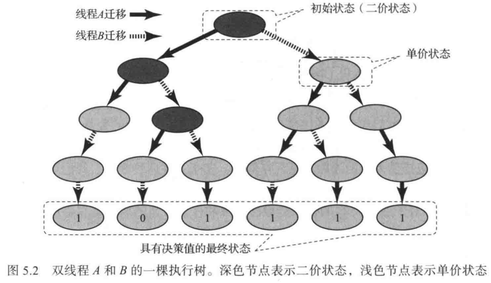

下面的引理说明存在一个二价的初始状态。该结论表明协议的结果不能预先确定，而必须取决于读取和写入的交错次序。

**引理 5.1.4**  所有双线程共识协议都存在一个二价的初始状态。

**证明**  假设初始状态时线程 A 的输入为 0, 线程 B 的输人为 1。如果线程 A 在线程 B 执行之前完成了协议，那么线程 A 必须确定决策值为 0，因为线程 A 必须确定某个线程的输入，而 0 是线程 A 看到的唯一输入（线程 A 不能确定决策值为 1，因为它无法区分线程 B 的输入是 I 还是 0）。与之对应，如果线程 B 在线程 A 执行之前完成了协议，那么线程 B 必须确定决策值为 1。由此可见，线程 A 的输入为 0、线程 B 的输入为 1 的初始状态是二价的。证毕。

**引理 5.1.5**  每个 n - 线程共识协议都有一个二价的初始状态。

**证明** 作为练习题。

一个协议状态如果满足以下条件，则该协议的状态是**临界的**（critical）：

* 协议的状态是二价的，
*  如果任何一个线程迁移，该协议的状态将变为单价状态。

**引理 5.1.6**  所有无等待的共识性协议都有一个临界状态。

**证明**  根据引理 5.1.5，该协议具有一个二价的初始状态。在此状态下启动协议。如果存在某个线程可以在不使协议状态变为单价的情况下发生迁移，则让该线程迁移。由于协议是无等待的，因此该协议不能一直运行。因此，该协议最终进入一个不可能进行上述迁移的状态，根据定义，这个状态是一个临界状态。证毕。 

到目前为止，我们所证明的一切结论都适用于任何共识性协议，无论它使用的是什么类型的共享对象。接下来我们讨论特定的对象类。

## 2. 原子寄存器

首先考虑以下问题：是否可以使用原子寄存器来解决共识性问题。令人惊讶的是，答案是否定的，我们将证明对于两个线程而言，不存在双线程的二值共识协议。

作为练习题，请读者证明以下结论：如果两个线程不能在两个值上达成共识，那么 n 个线程就不可能在 k 个值上达成共识，其中 n>=2 和 k>=2。

在讨论是否存在解决某个特定问题的协议时，通常会构造以下场景：“如果存在一个这样的协议，则在以下的情况下，该协议具有这样的行为。” 其中一个常用的场景是让一个线程（例如线程 A）完全独立运行，直到它完成协议。由于这个特殊的场景非常常见，所以我们称之为 “线程 A **独立运行**（solo）”。

**定理 5.2.1**  原子寄存器的共识数为 1。

**证明**  假设两个线程 A 和 B 存在一个二值共识协议，我们对该协议的特性进行了推理，从而得出矛盾的结论。

根据引理 5.1.6，可以让这个协议运行直到它达到一个临界状态 s。假设线程 A 的下一步迁移将使该协议变为 0 - 价状态，线程 B 的下一步迁移将使协议变为 1- 价状态（如果结果相反，那么请交换线程名称）。请问接下来线程 A 和 B 将要调用什么方法呢？现在考虑所有的可能性：其中的一个线程对一个寄存器执行读取操作，或者两个线程都写入不同的寄存器， 再或者两个线程都写入同一个寄存器。

假设线程 A 准备读取一个给定的寄存器（线程 B 可能准备读取或者写入相同的寄存器，或者读取/写入不同的寄存器）， 如图 5.3 所示。考虑两种可能的执行情形。在第一种情形中，线程 B 首先迁移，使协议变为 1- 价状态 s'，然后线程 B 独立运行并最终确定决策值 1。 在第二种执行情形中，线程 A 首先迁移，使协议变为 0 - 价状态，然后线程 B 执行一步并且到达状态 s''。然后线程 B 从状态 s'' 开始独立运行并且最终确定决策值 0。此时所面临的问题是，线程 B 无法区分状态 s' 和  s''（线程 A 的读取只能更改其本地状态，而线程 A 的本地状态对于线程 B 是不可见的），这意味着线程 B 必须在两种情况下确定相同的决策值，从而产生了矛盾。

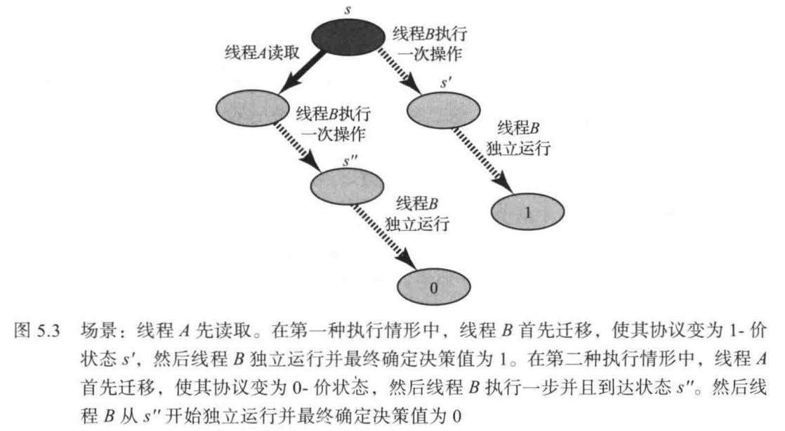

假设另一种场景，两个线程都将写人不同的寄存器，如图 5.4 所示。线程 A 准备写入 r0，而线程 B 准备写入 r1。考虑两种可能的执行情况。在第一种情形下，首先线程 A 写入 r0，然后线程 B 写入 r1；由于线程 A 首先执行，因此产生的协议状态是 0 - 价的。在第二种情形下，线程 B 写入 r1，然后线程 A 写入 r0；由于线程 B 首先执行，因此最终的协议状态是 1 - 价的。

问题是上述两种情形都会导致相同的协议状态。无论线程 A 还是线程 B 都无法确定哪一个迁移首先进行。由此产生的结果状态既是 0- 价状态又是 1- 价状态，从而产生了矛盾。

最后，假设两个线程都准备写入同一寄存器 r，如图 5.5 所示。再次考虑两种可能的执行情形。在第一种情形下，线程 A 首先写入，线程 B 再写入，得到的协议状态 s' 是 0- 价的，然后线程 B 单独运行，并决定决策值为 0。在另一种情形下，线程 B 首先写入，得到的协议状态 s" 是 1- 价的，然后线程 B 独立运行并确定决策值为 1。现在的问题是，线程 B 不能区分状态 s' 和 s''（因为不管是在状态 s' 还是 s" 中，线程 B 都重写了寄存器 r 并擦除了线程 A 的任何写入痕迹）， 所以线程 B 必须从任意状态开始确定相同的值，从而产生了矛盾。

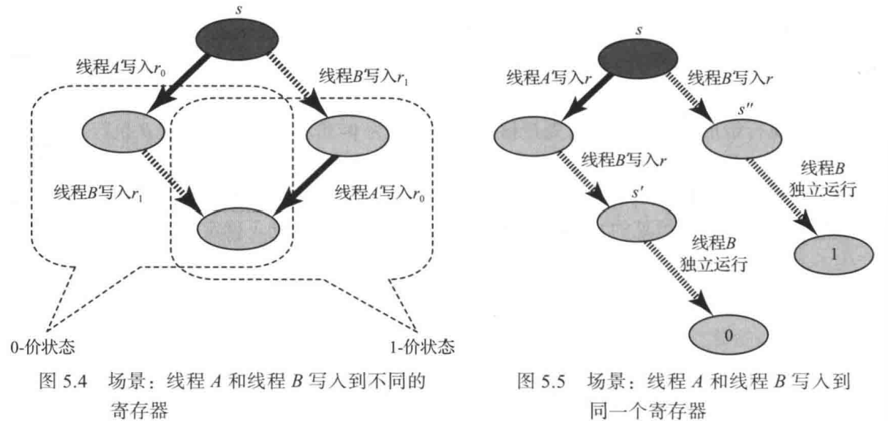

**推论 5.2.2**  对于任意一个共识数大于 1 的对象，使用原子寄存器不可能构造一个该对象的无等待的实现。

上述推论是计算机科学中最引人注目的不可能结论之一。它给出了以下结论，如果我们想在现代多处理器上实现无锁的并发数据结构，那么硬件除了必供加载和存储（即读取和写入）操作外，还必须提供同步操作原语。

## 3. 共识性协议

接下来我们将讨论一系列令人关注的对象类，研究每种对象类可以在多大程度上解决共识性的问题。这些协议具有一种通用范式，如图 5.6 所示。对象具有一个原子寄存器数组，每个 decide() 方法调用在数组对应该线程的寄存器中存入自己的输入值，然后继续执行一系列的操作步骤，以从所有指定的值中确定一个决策值。我们使用不同的同步对象来构造 decide() 方法的不同实现。

```java
public abstract class ConsensusProtocol<T> implements Consensus<T> {
    protected proposed = (T[]) new Object[N]; // N 是线程的数量
    // 向其他线程通知自己的输入值
    void propose(T value) {
        proposed[ThreadID.get()] = value;
    }
    // 决定哪个线程优先
    abstract public T desicde(T value);
}
```

<p align="center">图 5.6 通用共识性协议</p>

## 4. FIFO 队列

在第 3 章中，我们讨论了一种仅使用原子寄存器来实现一个无等待的 FIFO 先人先出队列的方法，但该实现仅限于一个线程入队和一个线程出队的情况。很自然读者就会提出疑问，是否可以构造一个支持多个入队线程和多个出队线程的 FIFO 队列的无等待实现呢？现在让我们讨论一个更具体的问题：是否可以使用原子寄存器构造一个双出队线程的 FIFO 队列的无等待实现？

**引理 5.4.1**  双出队线程的 FIFO 队列类的共识数至少为 2。

**证明**  图 5.7 描述了使用单个 FIFO 队列实现的双线程共识协议。其中，该队列中存储整数值。通过将值 WIN 和值 LOSE 先后人队来初始化队列。与本文讨论的其他所有共识性协议一样，decide() 方法首先调用 propose(v) 方法，将值 v 存储在 proposed[] 数组中，其中， proposed[] 数组是一个保存线程输入值的共享数组。然后继续让队列中的下一个数据元素出队，如果该数据元素的值是 WIN，那么调用线程优先，它确定自己的决策值。如果该数据元素的值是 LOSE，则另一个线程优先，因此调用线程返回存储在 proposed[] 数组中的另一个线程的输人值。

该协议是无等待的，因为它不包含闭环。如果每一个线程都返回自己的输入，那么它们必须都让值 WIN 出队，这违反了 FIFO 队列的定义规范。如果每一个线程都返回另一个线程的输入，那么它们必须都让值 LOSE 出队，这也违反了 FIFO 队列的定义规范。

在任何值出队列之前，出队值 WIN 的线程将其输入存储在 proposed[] 数组中。因此，有效性条件成立。证毕。

只需要稍微修改一下这个程序，就可以构造出适用于堆栈、优先队列、列表、集合，以及其他不同的调用次序返回不同结果的对象的协议。

```java
public class QueueConsensus<T> extends ConsensusProtocol<T> {
    private static final int WIN = 0;	// 第一个线程
    private static final LOSE = 1;		// 第二个线程
    Queue queue;
    // 使用两个数据元素来初始化队列
    public QueueConsensus() {
        queue = new Queue();
        queue.enq(WIN);
        queue.enq(LOSE);
    }
    // 决定哪个线程优先
    public T desicde(T value) {
        propose(value);
        int status = queue.deq();
        int i = THreadID.get();
        if (status == WIN) 
            return proposed[i];
        else
            return proposed[1-i];
    }
}
```

<p align="center">图 5.7 使用一个单一 FIFO 队列实现的双线程共识协议</p>

**推论 5.4.2**  使用一组原子寄存器不可能构造出队列、堆栈、优先级列、列表、集合的无等待实现。

虽然 FIFO 队列解决了双线程的共识性问题，但并不能解决三个线程的共识性问题。

**定理 5.4.3**  FIFO 队列的共识数为 2。

**证明**  采用反证法来证明。假设存在一个针对线程 A 、B 和 C 的共识性协议。根据引理 5.1.6，该协议有一个临界状态 s。不失一般性，可以假设线程 A 的下一步迁移将使协议变为 0 - 价状态，而线程 B 的下一步迁移将使协议变为 1- 价状态。接下来采用如前所述的案例分析法进行分析。

由于线程 A 和线程 B 的挂起迁移不可交换，且它们不能使用共享寄存器通信（定理 5.2.1），因此二者必须通过调用同一个队列对象的方法来交互。

> *队列操作的顺序会影响结果，所以 A 和 B 的方法调用不能交换。不使用共享寄存器通信是为了保证共识能力是由队列本身提供的。*

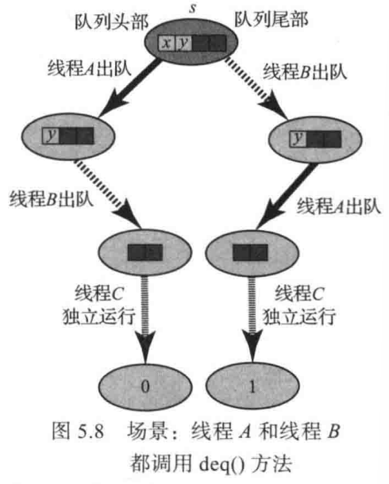

首先，假设线程 A 和线程 B 都调用 deq() 方法， 如图 5.8 所示。假设线程 A 先出队然后线程 B 再出队后的协议状态为 s'，而线程 B 先出队然后线程 A 再出队后的协议状态为 s''。由于 s' 是 0 - 价的，如果线程 C 从 s' 开始无中断地一直运行，那么线程 C 将确定决策值为 0。因为 s'' 是 1 - 价的，如果线程 C 从 s'' 开始无中断地一直运行，那么线程 C 将确定决策值为 1。但是线程 C 无法区分 s' 和 s'' (从队列中移除了两个相同的数据元素)，因此线程 C 必须在两种状态下确定相同的值，从而产生了矛盾。

其次，假设线程 A 调用 enq(a) 方法，而线程 B 调用 deq() 方法。如果队列是非空的，那么直接产生了矛盾。其原因在于：这两种方法可以交换 (每种方法在队列的不同端进行操作)，而线程 C 无法观察到它们发生的次序。假设队列是空的，那么如果线程 B 对空队列执行一个出队操作然后线程 A 执行了入队操作，则到达 1 - 价状态；如果线程 A 单独执行了入队操作，则到达 0 - 价状态。然而，这个 0 - 价状态和 1- 价状态对线程 C 是不可区分的。 请注意，在一个空队列上执行 deq() 操作的效果 (即中止还是等待) 并不重要，因为这不会影响该状态对线程 C 的可见性。

最后，假设线程 A 调用 enq(a) 方法，而线程 B 调用 enq(b) 方法，如图 5.9 所示。设 s' 为以下操作结束时的状态：

1. 线程 A 和线程 B 分别将元素 a 和 b 按先后次序入队。
2. 运行线程 A 直到它将元素 a 出队（因为观察队列状态的唯一方法是调用 deq() 方法，所以线程 A 在未观察到 a 或者 b 之前无法做出决定）。
3. 在线程 A 继续执行之前，运行线程 B 直到该线程使元素 b 出队。

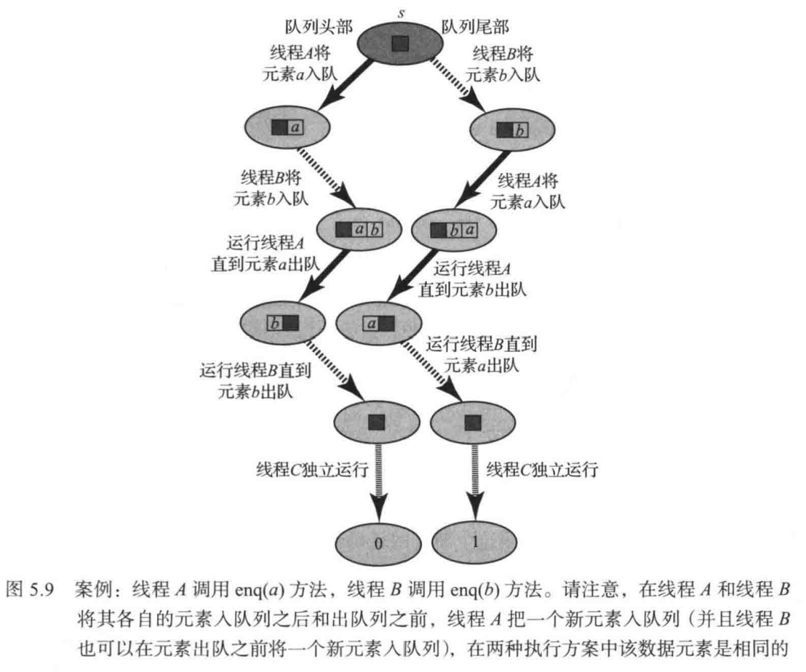

设 s'' 为以下操作执行后的状态：

1. 线程 B 和线程 A 分别将元素 b 和 a 按先后次序入队。
2. 运行线程 A 直到该线程将元素 b 出队。
3. 在线程 A 继续执行之前，运行线程 B 直到该线程使元素 a 出队。

很明显，s' 是 0 - 价的，s'' 是 1 - 价的。在这两种情形下，线程 A 的执行都是相同的，线程 A 一直运行直到元素 a 或者 b 出队。这两种情形下线程 B 的执行也是相同的，线程 B 一直运行直到使元素 a 或者 b 出队。根据迄今为止很常见的论证方法，由于线程 C 无法区分 s' 和 s''，因此产生了矛盾。证毕。

对上述论证过程稍加修改，就可以证明许多类似的数据类型，例如集合、堆栈、双端队列和优先级队列，它们的共识数也正好为 2。

## 5. 多重赋值对象

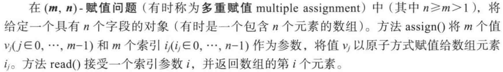

图 5.10 显示了一个（2, 3）- 赋值对象的基于锁的实现。其中，线程能够以原子方式对三个数组元素中的任意两个元素进行赋值。

```java
public class Assign23 {
    int[] r = new int[3];
    public Assign23(int init) {
        for (int i = 0; i < r.length; i++) {
            r[i] = init;
        }
    }
    public synchronized void assign(int v1, int v1, int i0, int i1) {
        r[i0] = v0;
        r[i1] = v1;
    }
    public synchronized int read(int i) {
        return r[i];
    }
}
```

<p align="center">图 5.10 （2, 3）- 赋值对象的基于锁的实现</p>

多重赋值问题是**原子快照**的对偶问题（4.3 节）， 在原子快照对象中，是对单个字段赋值，并以原子方式读取多个字段。由于快照可以使用读取 - 写入寄存器来实现，因此定理 5.2.1 隐含地表明快照对象的共识数为 1。但是，对于多重赋值对象，情况并非如此。

**定理 5.5.1**  使用原子寄存器无法构造一个（m, n）- 赋值对象 (n > m > 1) 的无等待实现。

**证明**  对于给定的两个线程以及一个（2, 3）- 赋值对象，只需要证明能够求解 2 - 线程共识性问题即可。和通常一样，decide() 方法必须决定首先运行哪一个线程。所有的数组元素都被初始化为空值（null）。图 5.11 描述了该协议。线程 A（ID 为 0）以原子方式写入字段 0 和 1，而线程 B（1D 为 1 ）以原子方式写入字段 1 和字段 2。 然后他们尝试决定谁先运行。从线程 A 的角度来看，存在着以下三种情况（如图 5.12 所示）：

* 如果首先执行线程 A 的赋值，而线程 B 的赋值尚未发生，则字段 0 和 1 包含线程 A 的值，字段 2 为空值。线程 A 确定自己的输人值。
* 如果首先执行线程 A 的赋值，随后执行线程 B 的赋值，那么字段 0 包含线程 A 的值，字段 1 和字段 2 包含线程 B 的值。线程 A 确定自己的输入值。
* 如果首先执行线程 B 的赋值，随后执行线程 A 的赋值，那么字段 0 和 1 包含线程 A 的值，字段 2 包含线程 B 的值。由线程 A 确定线程 B 的输入值。

同样的分析也适用于线程 B。证毕。

```java
public class MuitiConsensus<T> extends ConsensusProtocol<T> {
    private final int NULL = -1;
    Assign23 assign23 = new Assign23(NULL);
    public T decide(T value) {
        propose(value);
        int i = ThreadID.get();
        int j = 1-i;
        // 双重赋值
        assign23.assign(i, i, i, i + 1);
        int other = assign23.read((i + 2) % 3);
        if (other == NULL || other == assign23.read(1))
            return proposed[i];	// 胜出
        else
            return proposed[j];	// 出局
    }
}
```

<p align="center">图 5.11 使用 (2, 3) - 多重赋值对象的双线程共识性</p>

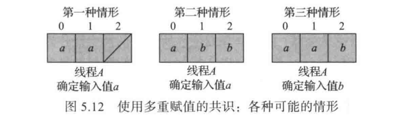

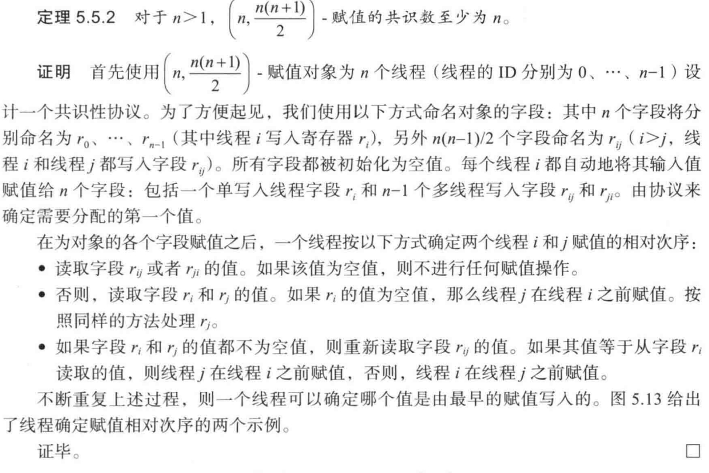

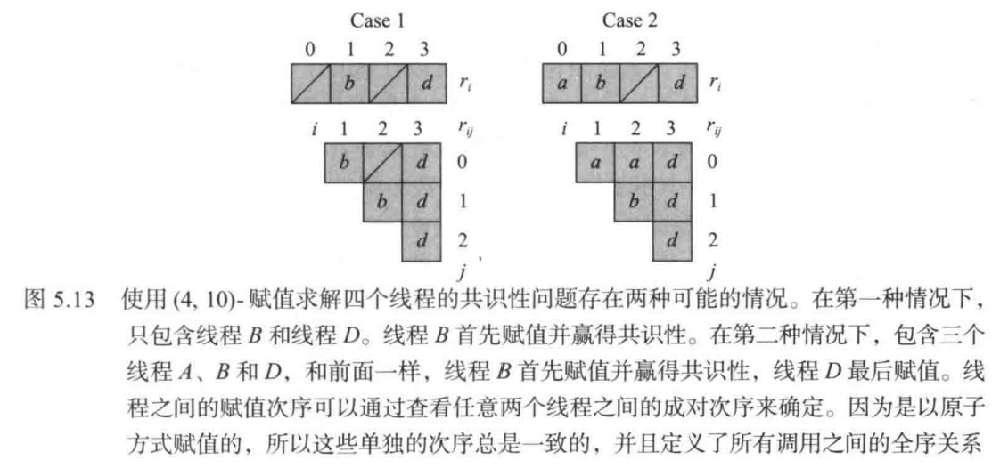


## 6. 读取 - 修改 - 写入操作

大多数多处理器硬件提供的同步操作通常可以表示为**读取 - 修改 - 写入**（read-modify-write，简称 RMW）操作，或者按照其对象术语，称为“读取 - 修改 - 写入”寄存器。下面讨论一个封装了整数值的 RMW 寄存器，令 F 是一组从整数到整数的映射函数（有时 F 是一个单例集）。

对于某个 f $\in$ F，如果一个方法能够使用 f(v) 以原子方式替换当前寄存器的值 v 并返回原始值 v，那么该方法就是函数集 F 的一个 RMW 操作。本书基本上遵循 Java 约定，把使用函数 mumble 的 RMW 方法称为 getAndMumble()。

例 如，java.util.concurrent.atomic 包中提供了 Atomiclnteger 类，该类包含各种 RMW 方法。

* getAndSet(v) 方法使用 v 以原子方式替换寄存器的当前值，并返回寄存器中的先前值。 这个方法（也称为 swap() 方法）是类型为 f(x)=v 的常量函数集的一个 RMW 方法。
* getAndIncrement() 方法以原子方式将寄存器的当前值递增 1，并返回寄存器中的先前值。这种方法（也称为读取并递增方法，fetch-and-increment）是函数 f(x)=x+1 的一 个 RMW 方法。
* getAndAdd(k) 法以原子方式把值 k 累加到寄存器的当前值，并返回寄存器的先前值。这种方法（也称为读取并累加方法，fetch-and-add）是函数集 f(x)=x+k  的一个 RMW 方法。
* compareAndSet() 方法包含两个参数值：一个是期望值 e, 一个是更新值 u。如果寄存器的当前值等于 e，它将被以原子方式替换为 u ，否则寄存器的值将保持不变。无论采取哪种方式，该方法都会返回一个布尔值，指示寄存器的值是否被更改。
* get() 方法返回寄存器的值。该方法是恒等函数 f(v)=v 的一个 RMW 方法。

本书采用**同步的** (synchronized) Java 方法定义 RMW 寄存器及其方法，但在实际应用中，它们与许多实际的或者被提议的硬件同步原语（完全或者几乎）相对应。

如果一组函数至少包含一个不是恒等函数的函数，则它是非平凡的函数（ nontrivial ）。如果一个 RMW 方法的函数集是非平凡的，则该 RMW 方法是非平凡的；如果一个 RMW 寄存器包含非平凡的 RMW 方法，则该 RMW 寄存器是非平凡的。

**定理 5.6.1**  任何一个非平凡 RMW 寄存器的共识数至少为 2。

**证明**  图 5.14 描述了一种双线程共识性协议。由于 F 中存在不是恒等函数的函数，因此存在一个值 v，使得 f(v)≠v。在 decide() 方法中，propose(v) 方法将线程的输入 v 写入到 proposed[] 数组中，然后每个线程将 RMW 方法应用于一个共享寄存器。如果一个线程的调用返回 v，则该线程首先第一个被线性化，然后它确定自己的决策值。否则，该线程会第二个被线性化，然后确定另一个线程的建议值。证毕。 

```java
class RMWConsensus extends ConsensusProtocol {
    // 初始化为 v，使得 f(v)!=v
    private RMWRegister r = new RMWRegister(v);
    public Object decide(Object value) {
        propose(value);
        int i = ThreadID.get();	// 该线程的索引
        int j = 1 - i;			// 其他线程的索引
        if (r.rmw() == V)		// 线程是第一个，获胜
            return proposed[i];	
        else					// 线程是第二个，出局
            return proposed[j];
    }
}
```

<p align="center">图 5.14 使用 RMV 操作的双线程共识性协议</p>

**推论 5.6.2**  对于两个或者更多线程，使用原子寄存器不可能构造出一个非平凡的 RMW 方法的无等待实现。

## 7. Common2 RMW 操作

接下来讨论一类称为 Common2 的 RMW 寄存器，这种寄存器对应于 20 世纪末大多数处理器所支持的常用同步原语。尽管 Common2 寄存器和所有非平凡的 RMW 寄存器 一样，具有比原子寄存器更为强大的能力，但我们发现它们的共识数正好是 2，这意味着 Common2 寄存器的同步能力是有限的。幸运的是，在当代处理器体系结构中已经基本上放弃了这些同步原语。

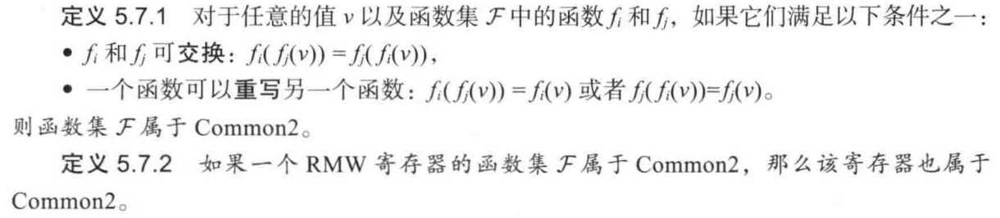

文献中的许多 RMW 寄存器都属于 Common2。例如，getAndSet() 方法使用一个常量函数，它重写任何先前的值。getAndIncrement() 方法和 getAndAdd() 方法使用了可相互交换的函数。

这里非形式化地解释说明一下为什么 Common2 中的 RMW 寄存器不能解决三线程共识性问题：第一个线程 (获胜者) 总是可以判断它自己是第一个线程，而第二个线程和第三个线程 (都是出局者) 也都能够判断它们自己不是第一个线程。但是，由于 Common2 中用来定义操作之后协议状态的函数是可交换和可重写的，所以出局的线程无法识别其他哪个线程是获胜线程 (即运行的第一个线程)，并且由于协议是无等待的，所以出局的线程也不可能一直等待直到发现哪个是获胜者为止。接下来对该结论进行更为准确的论证。

**定理 5.7.3**  Common2 中的任意一个 RMW 寄存器的共识数（恰好）为 2。

**证明**  根据定理 5.6.1，所有 RMW 寄存器的共识数至少为 2，现在只需要证明 Common2 寄存器不能够解决三线程的共识性问题即可。

采用反证法。假设存在一个只使用 Common2 寄存器和读取 - 写入寄存器的三线程协议。假设线程 A 、B 和 C 通过 Common2 寄存器达成了共识性。根据引理 5.1.6，任何这样的协议都有一个临界状态 s，在此状态下的协议是二价的，但是任何线程的任何方法调用都会导致协议进人一个单价状态。

接下来进行案例分析，检查每种可能的方法调用。定理 5.2.1 证明中使用的推理方法表明，挂起的方法不能被读取或者写入，线程也不能调用不同对象的方法。因此，线程将调用单个寄存器 r 的 RMW 方法。

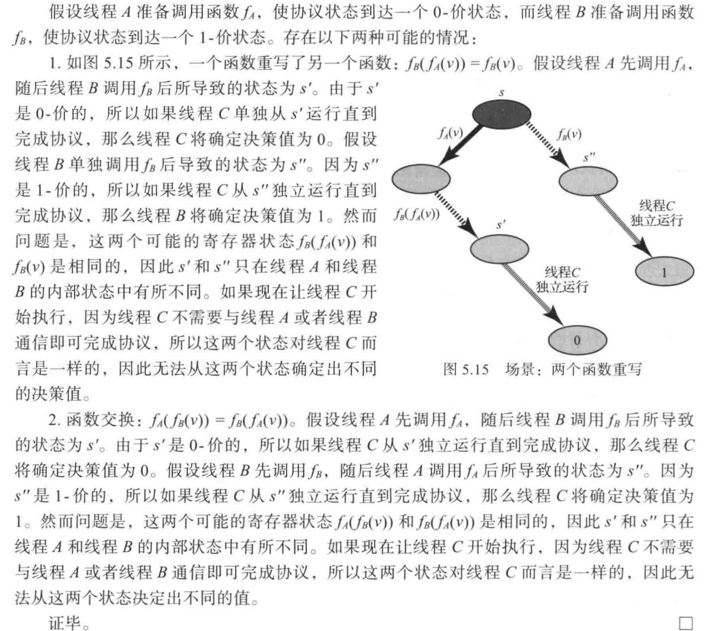

## 8. compareAndSet 操作

本节讨论 compareAndSet() 操作（也被称为**比较和交换** compare and swap 操作）， 它是很多型号的现代计算机体系结构（例如英特尔奔腾的 CMPXCHG）所支持的一种同步操作。该操作包含两个参数：一个**期望值**和一个**更新值**，如果当前寄存器的值等于期望值，则使用更新值替换当前寄存器的值，否则寄存器的值保持不变。该方法调用返回一个布尔值，用以指示寄存器的值是否被更改。

**定理 5.8.1**  能够支持 compareAndSet() 方法和 get() 方法的寄存器，其共识数的数量是无限的。

**证明**  图 5.16 描述了一种使用 Atomiclnteger 类的 compareAndSet() 方法而构造的 n 个线程的共识性协议，所有这 n 个线程共享一个 Atomiclnteger 对象，该对象初始化为一个常量值 FIRST，该常量值不同于任何线程的索引。每个线程以 FIRST 作为期望值、以线程自己的索引作为更新值，为参数调用 compareAndSet() 方法。如果线程 A 的调用返回 true，那么该方法调用是线性化次序中的第一个，因此线程 A 决定自己的值。否则，线程 A 读取 Atomiclnteger 的当前值，并从 proposed[] 数组中获取该线程的输入。证毕。

注意，图 5.16 中 compareAndSet() 寄存器只提供了一个 get() 方法，这仅仅是为了方便起见，对于协议来说并不是必需的。

```java
class CASConsensus extends ConsensusProtoco {
    private final int FIRST = -1;
    private AtomicInteger r = new AtomicInteger(FIRST);
    public Object decide(Object value) {
        propose(value);
        int i = ThreadID.get();
        if (r.compareAndSet(FIRST, i)) // 该线程胜出
            return proposed[i];
        else							// 该线程出局
            return proposed[j];
    }
}
```

<p align="center">图 5.16 使用 compareAndSet() 方法的共识性协议</p>

**推论 5.8.2**  仅支持 compareAndSet() 方法的寄存器，其共识数的数量是无限的。

我们将在第 6 章中讨论，提供 compareAndSet() 等原语操作的机器与串行计算图灵机的异步计算机器等价：对于任意一个并发对象，如果该对象是可实现的，那么必定可以在这种机器上以无等待的方式实现。因此，我们引用 Maurice Sendak 的话：**compareAndSet() 原语操作是万物之王**。